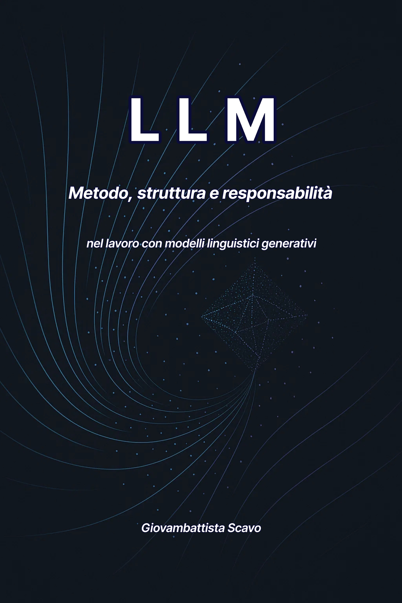

# LLM

*Metodo, struttura e responsabilità nel lavoro con modelli linguistici generativi*

**Giovambattista Scavo**

## Prefazione

Usare un LLM non è mai stato, per me, un esercizio di curiosità tecnologica.  
È nato come esigenza pratica.

Avevo progetti complessi da portare avanti — narrativi, tecnici, strategici — che richiedevano ordine, struttura, rigore, capacità di analizzare rapidamente grandi quantità di materiale, di creare varianti, di generare tentativi, di comparare possibilità.  
Lavori che, pur diversi tra loro, avevano una cosa in comune:  
richiedevano una mente capace di sostenere un flusso cognitivo continuo.

Quando i modelli linguistici sono diventati abbastanza maturi da potermi affiancare, ho iniziato a usarli come si userebbe un attrezzo nuovo: con interesse, cautela e una buona dose di sperimentazione.  
  
Ben presto mi sono accorto che la qualità dell’output non dipendeva soltanto dal modello: dipendeva anche da me.

Non era l’IA a migliorare.

Ero io.

Prompt dopo prompt, progetto dopo progetto, ho iniziato a riconoscere segnali, derive, incoerenze, comportamenti ricorrenti. Ho visto da vicino come un LLM interpreta un testo, quanto segue il tono dell’utente, quanto la chiarezza cambia il risultato, quanto un contesto instabile genera risposte instabili.  
  
Soprattutto, ho scoperto che ogni miglioramento nasceva da una domanda:

*“Che cosa sto comunicando davvero?”*

È così che il prompting, da semplice uso dello strumento, è diventato metodo:  
un modo di organizzare il pensiero, di costruire processi, di mantenere coerenza, di identificare errori prima che si manifestino.

Ho iniziato a personalizzare l’uso dell’LLM in tre direzioni:

1.  Strutturazione del contesto  
    Per mantenere stabilità in progetti lunghi.  
    Non una chat, ma un ambiente. Non un messaggio, ma un sistema.

2.  Prompting meta-cognitivo  
    Per farmi spiegare dal modello come stava interpretando le mie istruzioni, quali elementi stava seguendo, quali rischiavano di andare perduti.  
    Un dialogo progettuale, non un semplice scambio.

3.  Architetture di prompting  
    Per costruire moduli, frame, cicli, glossari, ancoraggi:  
    una vera e propria infrastruttura generativa capace di sostenere lavori complessi senza cedere.

I miglioramenti non sono arrivati perché “l’IA è brava”, ma perché il metodo è diventato preciso. Il prompting mi ha obbligato a pensare meglio, a scrivere meglio, a progettare meglio.

Questo manuale nasce da quell’esperienza.  
Non è la celebrazione di una tecnologia, né un compendio teorico: è il distillato pratico di migliaia di interazioni, tentativi, fallimenti e successi.

È un libro per chi vuole usare un LLM non come intrattenimento, ma come strumento professionale.  
Per chi vuole comprendere i principi che governano l’interazione con la macchina.  
Per chi desidera trasformare la propria comunicazione in un processo progettuale.  
Per chi non cerca risposte automatiche, ma un linguaggio che aiuti a pensare.

Come metafora dell’interazione, un LLM può funzionare come uno specchio: amplifica alcuni segnali che gli offri, ma non è uno specchio neutro. Li rielabora attraverso ciò che ha appreso, le istruzioni che riceve e il sistema in cui opera. Quando impari a orchestrare questi elementi, l’IA non ti sostituisce.  
  
Ti potenzia.

Questo manuale è il tentativo di consegnarti quel potenziamento in forma di metodo:  
chiaro, replicabile, rigoroso.

Perché la qualità che riusciamo a ottenere da un modello linguistico non dipende soltanto dalla sua architettura.

Dipende anche dal modo in cui impariamo a usarlo.

## Come Usare Questo Manuale

Questo libro può essere letto dall’inizio alla fine oppure usato come manuale di consultazione. I Capitoli 1–3 costruiscono il lessico di base e mostrano come progettare una richiesta; i Capitoli 4–6 affrontano continuità, diagnosi e feedback sul proprio metodo; i Capitoli 7–8 passano dal singolo prompt al sistema di lavoro e formalizzano BLCDD; il Capitolo 9 ricompone i limiti in contromisure operative.

La seconda parte applica gli stessi principi a quattro domini: produzione testuale, worldbuilding e narrativa, immagini e video, codice e agenti. Le appendici non introducono un metodo parallelo: mostrano come lo stesso impianto cambia quando cambiano il mezzo, il rischio e il tipo di verifica. Una breve appendice finale rende trasparente la provenienza dei casi reali e collega le descrizioni funzionali usate nel testo ai progetti da cui sono tratte.

Le Sintesi operative alla fine dei capitoli sono pensate anche per il ritorno rapido su un tema già letto. Non è necessario memorizzare formule di prompt: è più utile capire quali informazioni servono, quali decisioni non vuoi delegare e quale evidenza considererai sufficiente.

Non è un corso di machine learning, non richiede competenze di programmazione e non è una raccolta di prompt “magici”. Chi cerca dettagli di training, infrastruttura o API dovrà affiancare fonti specialistiche. Qui il centro è il lavoro dell’utente: contesto, specifica, verifica, continuità e controllo del cambiamento.

## Indice

- [Prefazione](#prefazione)
- [Come usare questo manuale](#come-usare)
- [Parte I — Metodo](#parte-i)
  - [Capitolo 1 — Parlare con una mente probabilistica](#capitolo-1)
  - [Capitolo 2 — Come un LLM legge davvero un prompt](#capitolo-2)
  - [Capitolo 3 — L’uso del prompt: scegliere e progettare la strategia giusta](#capitolo-3)
  - [Capitolo 4 — Coerenza nel tempo](#capitolo-4)
  - [Capitolo 5 — Diagnostica del prompting](#capitolo-5)
  - [Capitolo 6 — Prompting meta-cognitivo](#capitolo-6)
  - [Capitolo 7 — Strutture complesse](#capitolo-7)
  - [Capitolo 8 — BLCDD](#capitolo-8)
  - [Capitolo 9 — I limiti del modello](#capitolo-9)
  - [Chiusura](#chiusura)
- [Parte II — Applicazioni](#parte-ii)
  - [Appendice A — Produzione testuale](#appendice-a)
  - [Appendice B — Worldbuilding e narrativa](#appendice-b)
  - [Appendice C — Produzione visiva](#appendice-c)
  - [Appendice D — Produzione di codice e agenti](#appendice-d)
  - [Appendice E — Origine dei casi di studio](#appendice-e)
- [Glossario operativo](#glossario)

> L’indice di GitHub e la struttura delle intestazioni permettono di navigare anche le singole sezioni interne senza riferimenti a numeri di pagina.

## PARTE I — METODO

### CAPITOLO 1 – Parlare con una mente probabilistica

La diffusione delle tecnologie che chiamiamo “intelligenza artificiale” sta trasformando la nostra epoca più velocemente di quanto siamo abituati a elaborare. Ogni innovazione produce stupore, entusiasmo e un po’ di timore; poi l’effetto wow svanisce e rimane la necessità di capire davvero di che cosa stiamo parlando.

All’inizio l’idea dominante era ingenua ma affascinante: la macchina che pensa.  
Poi sono arrivati i contenuti dozzinali, le ripetizioni degli stessi errori, i testi che “sembrano umani ma… qualcosa non torna”.

A parità di modello, strumenti e compito, il modo in cui strutturiamo l’interazione può modificare profondamente qualità e affidabilità del risultato.

Un modello linguistico non ragiona come una mente umana. Produce output attraverso operazioni matematiche sui pattern e sulle rappresentazioni apprese. La qualità del risultato non dimostra, da sola, intenzioni, esperienza soggettiva o una comprensione umana del contenuto.

Capire chi è il nostro interlocutore — e chi non è — è la base di tutto ciò che faremo in questo manuale.

#### 1. Cos’è un LLM (e cosa non è)

Un Large Language Model è un modello addestrato, nella sua forma fondamentale, a prevedere il token successivo sulla base dei token precedenti. Un token può essere una parola, una parte di parola o anche un segno di punteggiatura.  
Non ragiona come noi: genera strutture linguistiche coerenti a partire dai pattern appresi.

Detto in modo semplice:  
un LLM non possiede una banca dati affidabile dei fatti e non garantisce di sapere che ciò che dice sia vero. Genera risposte usando rappresentazioni e regolarità apprese.  
È proprio questa efficacia a poterci far scambiare plausibilità per conoscenza verificata.

##### Modello e sistema non sono la stessa cosa

Un LLM è il componente generativo. Il prodotto con cui interagiamo può aggiungere istruzioni di sistema, memoria, retrieval, file, strumenti, accesso a servizi esterni e logiche di orchestrazione. Le capacità del sistema non devono quindi essere attribuite automaticamente al modello isolato.

Training e post-training contribuiscono a formare il modello prima dell’uso; memoria, retrieval, strumenti e istruzioni di sistema sono invece elementi che il prodotto può rendere disponibili durante l’interazione.

#### 2. Modelli di riferimento

- **GPT** (OpenAI)

- **Claude** (Anthropic)

- **Gemini** (Google)

- **Llama** (Meta)

- **Mistral** (Mistral AI)

A questi si aggiungono i sistemi ibridi basati su **RAG** (Retrieval Augmented Generation): in questo caso non è il modello a recuperare informazioni, ma un modulo esterno che gli fornisce documenti rilevanti. È importante distinguere la parte **generativa** (LLM) dal meccanismo di **recupero**.

#### 3. Cosa si fa oggi con sistemi basati su LLM

- scrivere testi, analisi e riassunti

- interagire con sistemi multimodali o generatori, spesso orchestrati da LLM, per produrre immagini, video e audio

- produrre o ottimizzare codice

- creare bozze di siti web o interfacce

- integrare funzioni “intelligenti” in software tradizionali

- analizzare documenti, dataset e trascrizioni

- fare brainstorming e progettazione

La gamma è ampia, ma il principio resta lo stesso:  
non interpreta come una mente umana: genera e ricompone.

#### 4. Un LLM non è una mente (e non è un archivio)

##### Non attribuirgli pensieri umani

Non prova emozioni, non formula intenzioni, non ha desideri o opinioni.  
La sensazione di dialogo nasce da un meccanismo statistico estremamente raffinato: il modello riconosce e combina regolarità linguistiche apprese.

Come metafora dell’interazione, possiamo pensare al modello come a un’eco estremamente sofisticata. Non ripete semplicemente: rielabora, ricompone e ristruttura ciò che riceve attraverso le rappresentazioni e le priorità apprese.

Con l’aumento di scala, training e post-training si osservano capacità che possono emergere o rafforzarsi: catene logiche, riformulazioni complesse, classificazione, coding e problem solving. Questi comportamenti possono essere funzionalmente assimilabili a forme di ragionamento senza dimostrare, per questo, processi mentali umani.

##### **Non è nemmeno un archivio**

È una delle confusioni più comuni.

Un LLM non consulta un database interno,  
non va a cercare informazioni,  
non recupera dati aggiornati.

Ricostruisce **plausibilità**.

La metafora corretta è questa:  
non è una biblioteca, ma un autore che ha letto la biblioteca e ora prova a scrivere un nuovo capitolo usando ciò che ha interiorizzato.

#### 5. Generazione e retrieval: una distinzione chiave

**Un LLM genera il proprio output; un sistema di retrieval recupera informazioni da fonti esterne.**

È una distinzione fondamentale per capire molti usi avanzati.

- Un motore di ricerca o un sistema RAG recupera informazioni.

- Il modello generativo compone la risposta a partire dal contesto che gli viene fornito.

Il retrieval può fornire fonti pertinenti e aumentare la probabilità di una risposta fondata, ma non elimina automaticamente l’allucinazione: il modello può ignorare una fonte, interpretarla male o combinare in modo errato informazioni disponibili. Retrieval e verifica restano funzioni diverse.

Per tutto il manuale, questo principio sarà la bussola.

#### 6. Limiti operativi degli LLM

Nonostante la loro potenza, ci sono limiti operativi che è bene chiarire subito:

- non verificano empiricamente

- non accedono a informazioni aggiornate senza componenti esterne

- possono sbagliare calcoli complessi

- non possiedono intenzione, agency o responsabilità morale propria

- possono generare contenuti falsi ma plausibili (allucinazioni)

- non garantiscono un modello del mondo completo e coerente

Capire questi limiti non riduce la potenza dello strumento:  
la rende controllabile.

#### 7. Perché due risposte possono essere diverse?

Per capire perché gli output cambiano conviene distinguere due fenomeni: la sensibilità all’input e la variabilità tra esecuzioni dello stesso input.

##### Sensibilità all’input

Formulazione, ambiguità, tono, esempi e contesto orientano la distribuzione degli output possibili. Cambiare questi elementi significa cambiare l’input effettivo, non osservare due run identiche.

##### Variabilità tra esecuzioni dello stesso input

Quando il sistema usa sampling stocastico, due esecuzioni dello stesso input possono produrre risposte differenti. Temperatura e altri parametri di decoding possono modificare questa variabilità; possono contribuire anche eventuali condizioni non deterministiche del sistema o differenze nel contesto realmente fornito a ciascuna esecuzione.

La variabilità non è necessariamente un difetto:  
può essere un vantaggio creativo, mentre nei compiti rigorosi va controllata.

#### Sintesi operativa

Un LLM genera output a partire da pattern e rappresentazioni apprese; il sistema che lo ospita può aggiungere memoria, retrieval e strumenti.

La forma convincente non certifica verità o comprensione. Quando il dato conta, serve evidenza esterna.

La variabilità può essere utile nei compiti creativi; nei compiti rigorosi va contenuta con specifiche, formati e controlli.

Il prompting non è chiedere: è orchestrare.

### CAPITOLO 2 – Come un LLM legge davvero un prompt

Quando scriviamo a un LLM ci sembra di dialogare con una mente.

Ma il modello non “interpreta” come farebbe un essere umano: scompone, pesa, riconosce pattern e ricostruisce coerenza.

Per capire perché un prompt funziona — o fallisce — conviene osservare come le sue componenti orientano l’output. Non come radiografia dei processi interni, ma come struttura operativa.

Un prompt non è mai solo un testo: è un insieme di segnali espliciti e impliciti che guidano una funzione probabilistica a generare una forma.

#### 1. Parsing operativo: scomporre il prompt

La scomposizione che segue non descrive letteralmente una fase interna del modello: è un modello operativo utile per progettare istruzioni più chiare.

Possiamo leggere una richiesta distinguendo le sue principali componenti funzionali.

Se il prompt è:

\> “Scrivi un’analisi chiara, concisa e strutturata in tre punti, evitando digressioni.”

Operativamente, possiamo distinguere:

il comando: scrivi

le qualità richieste: chiara, concisa

la struttura formale: tre punti

i vincoli negativi: evitare digressioni

Questa scomposizione non è un’interpretazione psicologica del modello, ma una mappa progettuale: ogni elemento contribuisce a orientare la generazione successiva.

Se un aspetto non è specificato, il modello tende a completarlo sulla base del contesto e dei pattern appresi.

Se è vago, aumenta lo spazio delle interpretazioni possibili.

Se è ambiguo, il modello deve convergere su una delle interpretazioni compatibili.

#### 2. Salienza e priorità delle istruzioni

All’interno di un prompt, non tutte le informazioni influenzano l’output nello stesso modo.

La loro salienza dipende da chiarezza, posizione, esplicitazione, coerenza reciproca, struttura del testo e contesto. Non esiste una gerarchia universale valida per ogni modello e ogni prompt.

1\. Istruzioni dirette (scrivi, analizza, riassumi…)

2\. Vincoli strutturali (in tre punti, in elenco, in 200 parole…)

3\. Tono e registro (formale, colloquiale, tecnico…)

4\. Contesto rilevante (informazioni necessarie al compito)

5\. Materiale secondario, incoerente o superfluo, che conviene separare o rimuovere

Questa lista è una guida progettuale, non una gerarchia interna del modello.

Se il prompt contiene richieste incompatibili, l’esito dipenderà da come quelle istruzioni competono nel contesto; per questo i conflitti vanno risolti esplicitamente dall’utente.

#### 3. Contesto locale ed esteso

Il prompt non vive da solo: viene letto all’interno di una cornice.

Contesto locale

È il messaggio attuale: tonalità, chiarezza, vincoli, struttura.

Contesto esteso

È il materiale precedente che il sistema rende disponibile al modello: messaggi, istruzioni, sintesi o altre informazioni di contesto.

Il modello non dispone di memoria autobiografica autonoma: lavora su ciò che il sistema gli rende disponibile nel contesto. Per questo:

se il prompt usa un registro tecnico, l’output tenderà a seguirlo

se il registro diventa colloquiale, il modello tenderà ad adattarsi

se sono stati stabiliti regole o ruoli, il modello tenderà a mantenerli finché restano disponibili, salienti e coerenti

se la conversazione si confonde, anche l’output si confonde

Il modello non “ricorda” come una persona: continua a generare a partire dal contesto disponibile.

#### 4. I segnali impliciti del prompt

Un LLM non risponde solo al contenuto letterale, ma anche ai segnali impliciti:

livello di dettaglio

ritmo della frase

vaghezza o sicurezza

registro emotivo

quantità di esempi o astrazioni

richieste dirette vs attenuate (“se puoi”, “mi piacerebbe”, “forse”)

Per esempio:

\> “Mi potresti spiegare, se non ti dispiace, come funziona questo concetto?”

Produce una risposta più cauta, morbida e prolissa.

Perché il tono del prompt tende a orientare il tono dell’output, a meno che istruzioni più esplicite o altri vincoli non abbiano maggiore peso.

I segnali impliciti possono influenzare significativamente l’output, soprattutto quando le istruzioni esplicite lasciano margini di interpretazione.

#### 5. Dove nascono i fraintendimenti

Un LLM può “fraintendere” quando la richiesta lascia aperte più interpretazioni plausibili.

In quel caso deve convergere su una delle direzioni compatibili con il contesto, che può non coincidere con quella che avevi in mente.

Succede quando:

il focus non è dichiarato

il prompt ha due obiettivi diversi

il contesto precedente suggerisce un altro tono

mancano definizioni operative (“analizza” cosa? “In profondità” quanto?)

i vincoli sono troppo generici

il linguaggio del prompt è ambiguo

non esiste un criterio per scegliere tra due interpretazioni valide

Il prompting efficace consiste anche nel rimuovere ambiguità prima che il modello le completi implicitamente.

#### 6. Dal prompt all’intervento: esempi brevi

##### Dal criterio vago alla specifica verificabile

Prompt iniziale — «Analizza questo testo in profondità.»

Output problematico — una miscela plausibile di stile, contenuto e interpretazione, senza un criterio che permetta di capire se l’analisi sia davvero “profonda”.

Diagnosi — il problema non è la lunghezza della risposta: il criterio di profondità non è stato reso operativo.

Intervento — «Analizza il testo da tre prospettive: tecnica, emotiva e simbolica. Per ciascuna indica due osservazioni e un esempio testuale.»

Risultato atteso — una struttura confrontabile con la richiesta, quindi più facile da verificare e correggere.

Principio: quando un criterio è importante, trasformalo in qualcosa che puoi osservare.

##### Il tono come segnale implicito

“Se puoi, mi aiuti a capire questa cosa?”

→ Il modello tende verso un registro più prudente e morbido.

“Spiega questo concetto in modo semplice e diretto, senza metafore.”

→ Risposta netta, asciutta, senza deviazioni.

La forma del prompt non è neutra: è parte della specifica che orienta il comportamento del modello.

#### Sintesi operativa

Prima di inviare una richiesta, controlla cinque cose:

• obiettivo esplicito;

• vincoli compatibili fra loro;

• contesto pertinente e non sovraccarico;

• termini vaghi trasformati in criteri osservabili;

• forma dell’output definita quando serve.

### CAPITOLO 3 – L’uso del prompt: scegliere e progettare la strategia giusta

Un prompt non è una domanda: è una progettazione in forma di frase.  
Ogni parola ha un peso, ogni omissione ha conseguenze, e la forma che scegli determina la forma della risposta.

In questo manuale distinguiamo due strategie di prompting particolarmente utili:

- A Layer (costruzione progressiva)

- **monolitica** (istruzioni complete in un unico blocco)

Capire quando usare l’una, l’altra — e quando combinarle — è la base del prompting avanzato.

#### 1. Prompt A Layer: costruire un risultato, non chiederlo

La strategia A Layer funziona come la lavorazione di un materiale: inizi da una bozza, osservi cosa emerge, e poi affini la forma.

Il processo tipico è:

1.  definizione del contesto

2.  prima generazione (grezza, esplorativa)

3.  raffinamento

4.  aggiunta dei vincoli mancanti

5.  convergenza verso l’obiettivo finale

È l’approccio ideale quando:

- non sai ancora esattamente cosa vuoi

- devi esplorare alternative

- lavori su testi lunghi o complessi

- vuoi un controllo passo per passo

- stai progettando, non solo chiedendo

Il prompting A Layer è la forma più vicina alla collaborazione:  
non imponi un risultato, costruisci una direzione.

#### 2. Prompt monolitico: dare tutto subito

Il prompting monolitico fa l’opposto: inserisci in un’unica istruzione tutto ciò che serve al modello per produrre il risultato finale.

Un buon prompt monolitico contiene:

- obiettivo

- contesto

- tono

- struttura

- vincoli

- livello di dettaglio

- eventuali esempi

- finalità del testo

È utile quando:

- hai già una visione chiara del risultato

- vuoi minimizzare l’ambiguità

- ti serve un output tecnico, stabile e ripetibile

- lavori con documenti formali (policy, report, manuali)

Il rischio principale è il sovraccarico: se il prompt è lungo ma poco strutturato, segnali importanti possono perdere salienza o competere tra loro, producendo un risultato meno stabile.

Nel prompt monolitico la completezza non coincide con l’accumulo: serve tutto ciò che è rilevante, in un ordine leggibile.

#### 3. Quando usare cosa? Un’euristica pratica

Chiediti:

> **“So già esattamente cosa voglio?”**

- Se la risposta è NO → prompt A Layer  
  Serve per esplorare, pensare, progettare.

- Se la risposta è SÌ → prompt monolitico  
  Serve per ottenere subito un risultato preciso.

- Se la risposta è in parte → combinazione  
  Prima esplori con gli strati, poi sintetizzi tutto in un monolitico finale.

Questa distinzione non è una legge. Un compito perfettamente definito ma complesso può richiedere decomposizione; un compito esplorativo semplice può invece essere risolto bene con un solo prompt.

La dinamica è la stessa della vita reale:  
prima valuti le possibilità, poi prendi una decisione.

#### 4. Come prevedere il comportamento del modello

Prevedere con certezza cosa farà un LLM non è possibile, ma alcune euristiche aiutano a progettare output più stabili.

##### **A) Il modello tende a seguire la forma che gli dai**

Chiedi 5 punti → aumenti la probabilità di ottenerne 5.  
Chiedi un tono formale → orienti l’output verso il formale.  
Il prompt funziona come uno stampo, non come una garanzia.

##### **B) Il modello tende ad amplificare precisione o vaghezza**

Prompt ambiguo → maggiore variabilità.  
Prompt strutturato → output generalmente più strutturato.  
Prompt tecnico → maggiore probabilità di un registro tecnico.

Il modello tende ad amplificare molti segnali presenti nello stile dell’utente.

##### **C) Il modello completa gli spazi lasciati aperti**

Se non definisci un criterio, il modello deve completarlo implicitamente.  
Lo farà sulla base del contesto e dei pattern appresi, non della tua intenzione non espressa.

Da qui nasce una parte importante degli errori di prompting.

#### 5. Gli elementi di una specifica efficace

A seconda del compito, una specifica efficace può esplicitare:

- un obiettivo chiaro

- un contesto sufficiente

- vincoli precisi

- una struttura dichiarata

- un tono richiesto

- un target dell’output

- eventuali esempi-modello

- un livello di dettaglio coerente

Un prompt non è un elenco di parole gentili:  
è una specifica tecnica espressa in linguaggio naturale.

#### 6. Esempi pratici: come cambia radicalmente l’output

Gli esempi mostrano concretamente la differenza tra “chiedere” e “progettare”.

##### **Esempio 1 – Tre analisi diverse dello stesso testo**

Testo:  
“Aveva imparato a vivere schivando il rumore: solo nel silenzio riusciva a sentire chi era davvero.”

Prompt A – Analisi stilistica  
Analizza questo testo dal punto di vista stilistico: ritmo, figure retoriche, scelta delle parole.

Prompt B – Analisi concettuale  
Analizza i temi impliciti del testo: identità, silenzio, fuga, percezione di sé.

Prompt C – Analisi emotiva  
Analizza l’emozione dominante, le sfumature psicologiche e il tono del narratore.

**Risultato:** tre output completamente diversi, perché cambia la funzione richiesta.

##### **Esempio 2 – Stessa funzione, tre toni formali**

A – Mail professionale  
Scrivi una mail professionale per chiedere un aggiornamento su un progetto, tono cordiale ma fermo.

B – Lettera aperta  
Scrivi una lettera aperta alla cittadinanza per annunciare l’avvio di un progetto urbano, tono istituzionale e inclusivo.

C – Comunicazione tecnica  
Scrivi una comunicazione amministrativa per annunciare l’avvio di un progetto, tono tecnico e neutrale.

**Stesso scopo → tre identità completamente diverse.**

##### **Esempio 3 – Costruire un background per post successivi**

Prompt 1 – Impostare il contesto  
Definisci tono, lessico e metafore narrative per una serie di post sulla produttività scritti dal punto di vista di un ingegnere navale con dieci anni di esperienza.

Prompt 2 – Usare il contesto  
Spiega il concetto di pianificazione settimanale utilizzando il tono e il linguaggio stabiliti nel contesto precedente.

Un LLM lavora sul contesto che gli dai:  
un contesto forte rende più probabile un output coerente; un contesto fragile aumenta lo spazio delle derive.

#### Sintesi operativa

Usa A Layer quando devi esplorare, isolare variabili o ridurre il rischio di una modifica; usa un prompt monolitico quando la specifica è stabile e conviene consegnarla tutta insieme.

La distinzione è un’euristica, non una legge: complessità, rischio e bisogno di verifica contano quanto la chiarezza dell’obiettivo.

Nei lavori reali le due strategie possono convivere: esplorazione per strati, consolidamento finale in una specifica completa.

### CAPITOLO 4 – Coerenza nel tempo: costruire continuità oltre la memoria del modello

Una delle illusioni più forti quando si lavora con un LLM è credere che il modello “si ricordi” come una persona.  
Considerato isolatamente, il modello non possiede una memoria autobiografica autonoma della conversazione.

Lavora sui contenuti che il sistema gli rende disponibili nel contesto corrente. Questi possono includere messaggi visibili, istruzioni di sistema, sintesi, documenti recuperati, dati persistenti o output di strumenti esterni.  
Questo implica una verità operativa importante:

la continuità non è garantita dal modello: va progettata dall’utente o dal sistema che lo utilizza.

Se il contesto è chiaro, coerente e stabile, aumenta la probabilità che il modello mantenga la direzione desiderata. Se si frammenta o si contraddice, l’output può diventare più instabile.

Essere presenti nel contesto non garantisce però che tutte le informazioni vengano usate con la stessa efficacia. Nei contesti molto lunghi possono emergere perdita di salienza, competizione tra istruzioni, effetti di posizione e difficoltà nel recuperare dettagli pertinenti. Per questo selezionare il materiale rilevante è parte del lavoro.

Nei progetti lunghi, il prompting è un lavoro di **manutenzione cognitiva**.

#### 1. Il modello non ricorda come una persona: lavora sul contesto disponibile

Ciò che appare come “ricordo” può derivare da informazioni rese nuovamente disponibili al modello nel contesto corrente, non da una memoria autobiografica analoga a quella umana.

In pratica, la continuità emerge quando il sistema gli fornisce riferimenti coerenti e sufficientemente stabili:

- riconosce schemi

- mantiene il tono dominante

- estende regole che vede applicate

- ricollega concetti tramite coerenze linguistiche

Non è memoria autobiografica: è continuità costruita attraverso il contesto.  
Ecco perché, nei progetti complessi, il contesto va progettato e mantenuto come un’infrastruttura.

#### Caso reale — Quando la coerenza sembrò memoria

Durante lo sviluppo di un romanzo strutturato di lunga durata, una parte del lavoro venne trasferita in una nuova conversazione per proseguire un’attività specifica. Furono portati alcuni dati e riferimenti, ma non l’intero contesto del progetto. L’aspettativa implicita era che il sistema potesse comunque ricostruire il resto attraverso la continuità disponibile.

Per diverse ore l’ipotesi sembrò funzionare. Le risposte erano pertinenti, coerenti con il tono e compatibili con il worldbuilding. Erano anche abbastanza specifiche da sembrare fondate su informazioni già presenti. Il problema emerse soltanto quando quel materiale iniziò a essere trasformato in testo definitivo.

Comparvero dettagli laterali e note di worldbuilding che suonavano corretti, ma non appartenevano realmente al progetto. La verifica mostrò che il modello non stava recuperando fedelmente una fonte originaria: stava completando i vuoti generando contenuti plausibili e coerenti con i pochi riferimenti disponibili.

Il punto critico non era l’assurdità dell’errore, ma la sua plausibilità. In un progetto narrativo o progettuale un dettaglio inventato può restare invisibile finché non entra in collisione con un elemento canonico.

**La coerenza dell’output non dimostra il possesso del contesto.**

Da questo fallimento nacque una pratica più disciplinata: trasferire esplicitamente il contesto necessario, distinguere dati presenti da inferenze, usare sintesi e handoff, mantenere glossari e punti fermi e, soprattutto, verificare che una nuova conversazione disponga davvero delle informazioni su cui pretende di lavorare.

Una domanda utile non è soltanto «conosci questo argomento?», ma «quali elementi sono effettivamente presenti nelle fonti o nel contesto, quali stai inferendo e quali non puoi verificare?».

#### 2. Dati stabili: costruire le fondamenta della continuità

Per mantenere la coerenza, il modello ha bisogno di “punti fermi”.  
I principali sono:

##### **A) Regole dichiarate**

Ruoli, vincoli, stile, struttura del progetto.

##### **B) Glossari e definizioni**

Impediscono lo slittamento dei significati.

##### **C) Diagrammi, scalette, gerarchie**

Danno solidità narrativa o progettuale.

##### **D) Frasi-ancora**

Ripetere concetti essenziali mantiene il modello allineato.

##### **E) Sintesi periodiche**

Riordinano il contesto ed eliminano il rumore.

#### 3. Come si perde la coerenza (e come evitarlo)

La perdita di coerenza non è misteriosa: ha cause regolari.

1.  Cambio improvviso di tono  
    Il registro recente può influenzare quello successivo.

2.  Contraddizioni interne  
    Istruzioni incompatibili aumentano l’instabilità dell’output.

3.  Eccesso di informazioni nuove  
    Può rendere meno chiaro quali elementi siano prioritari.

4.  Prompt ambigui dopo prompt precisi  
    Possono allentare vincoli che prima erano chiari.

5.  Omissione dei punti fermi  
    Regole non più disponibili o non più salienti possono perdere peso.

La coerenza raramente cade per un singolo errore:  
più spesso si degrada per accumulo, conflitto o perdita di riferimenti.

#### 4. Mantenere progetti lunghi: la tecnica dell’ancoraggio

L’ancoraggio è una forma di prompting ricorrente che stabilizza la continuità.

Un buon ancoraggio:

- ripete tono e obiettivi

- ribadisce la struttura del progetto

- richiama i concetti chiave

- specifica il livello di astrazione desiderato

Esempio:

> “Manteniamo il tono tecnico-colloquiale stabilito.  
> Ricorda che questo progetto mira a creare un manuale operativo sul prompting.  
> Gli esempi devono essere concreti e privi di accademismo.”

Inserito periodicamente, riduce il rischio di derive.

#### 5. Sintesi e ricostruzione: come stabilizzare il contesto

Una sintesi prodotta da un LLM non è necessariamente una semplice selezione di frasi dal testo originale: è una nuova generazione condizionata dal materiale disponibile.

Nel ricomporre quel materiale, il modello può rafforzare temi ricorrenti, generalizzare relazioni, omettere eccezioni o introdurre connessioni che nel testo originale erano soltanto implicite.

Questo spiega due fenomeni importanti:

##### **A) Perché le sintesi funzionano così bene**

Possono riordinare il materiale e rendere più salienti i concetti comuni tra parti diverse del progetto.

##### **B) Perché vanno usate al momento giusto**

Se chieste troppo presto o su materiale ancora instabile, le sintesi possono consolidare problemi già presenti, per esempio:

- introdurre errori

- enfatizzare dettagli marginali

- consolidare incoerenze nascenti

La sintesi è potente, ma richiede timing e verifica.

#### 6. Quando ricominciare è meglio che correggere

A volte la continuità non va aggiustata: va **resettata**.

Correggere un errore dentro un contesto già contaminato può diventare molto più difficile che ricostruire il contesto da una baseline pulita.

Un caso reale mostra meglio il problema di una semplice metafora visiva:

#### Caso reale — Quando il prompt preciso non bastò

Durante la produzione delle carte di un gioco strategico a turni con elementi da gioco di carte collezionabili (TCG), il primo approccio fu chiedere al generatore visivo di produrre direttamente la carta completa, o almeno una cornice già strutturata. Il layout richiedeva aree fisse per illustrazione, descrizione, statistiche e simboli, con geometrie e posizioni precise.

La risposta naturale fu rendere il prompt sempre più preciso. Vennero usate descrizioni della disposizione, misure, coordinate, dimensioni in pixel, schemi disegnati e immagini di riferimento. Eppure la geometria continuava a variare: una nuova generazione poteva spostare una casella, alterarne le proporzioni o modificare elementi che nella versione precedente erano corretti.

La correzione iterativa spesso peggiorava la situazione. Sistemare un elemento poteva produrre deviazioni altrove; dopo alcune iterazioni il risultato diventava più distante dalla baseline iniziale di quanto non fosse il primo tentativo.

A quel punto il problema non era più un prompt vago. Le istruzioni erano già diventate molto precise. L’assunzione sbagliata era un’altra: credere che una descrizione sufficientemente dettagliata potesse trasformare una generazione probabilistica in un sistema geometrico deterministico.

Il modello può seguire correttamente la struttura semantica di una richiesta senza garantire il controllo geometrico deterministico di un motore di rendering o di un sistema parametrico. Capire «quattro indicatori agli angoli» non equivale a garantire coordinate identiche tra generazioni.

**Non tutti i fallimenti di prompting si risolvono con un prompt migliore. A volte bisogna cambiare l’architettura del lavoro.**

La carta venne quindi scomposta in componenti: cornice, illustrazione, simboli, dati, numeri e testi. La generazione rimase utile dove serviva creatività visiva; la composizione finale passò invece a procedure deterministiche, misurazioni e parametri. Da questo percorso nacque una web app JavaScript per comporre e calibrare gli asset visivi del progetto, poi riassorbita in parte nel flusso del gioco strategico.

L’output generato smise così di essere trattato necessariamente come prodotto finito e diventò materia prima: qualcosa da ritoccare, uniformare, ricomporre e inserire dentro una pipeline più controllabile.

**Ciò che deve essere creativo può essere generato. Ciò che deve essere esatto conviene parametrizzarlo.**

Il caso mostrò anche un secondo limite: oltre una certa soglia, continuare a correggere la stessa generazione accumulava deviazioni. La soluzione più affidabile era tornare a una baseline pulita, ricostruire il prompt e rigenerare invece di prolungare indefinitamente la catena di correzioni.

Lo stesso criterio può valere anche per il testo quando una lunga catena di correzioni rende più difficile distinguere la baseline dagli aggiustamenti successivi.

Se un errore è radicato nel contesto, può essere più efficace ripartire da una nuova chat ben strutturata che continuare a correggerlo in cascata.

Ricostruire da zero non è una sconfitta:  
è manutenzione intelligente.

#### 7. Quando è davvero il momento di ripartire

Segnali chiari:

- i vincoli iniziali non vengono più rispettati

- emergono incoerenze ripetute

- il modello “fonde” parti del progetto che dovevano restare distinte

- la qualità dell’output peggiora senza motivo apparente

- hai bisogno di una nuova struttura narrativa o tecnica

In quel caso, raccogli:

- regole fondamentali

- glossario

- sintesi del progetto

- punti fermi

…e ricomincia.

Una nuova chat pulita può restituire ordine, chiarezza e precisione.

#### Sintesi operativa

Per mantenere continuità:

• conserva in fonti stabili ciò che non deve essere ricostruito per inferenza;

• riporta nel contesto solo il materiale pertinente al task corrente;

• usa sintesi e ancoraggi come manutenzione, non come rituale;

• se le correzioni iniziano a propagare nuovi errori, torna a una baseline pulita.

La coerenza dell’output non dimostra memoria; la precisione del prompt non sostituisce un controllo deterministico quando il compito lo richiede.

### CAPITOLO 5 – Diagnostica del prompting: capire gli errori del modello e dell’utente

A un certo punto, chiunque lavori seriamente con un LLM si trova davanti allo stesso dilemma:

> “Dove ho sbagliato? È il modello a non capire, o sono io ad aver scritto un prompt poco efficace?”

Molti problemi non nascono da una sola causa, ma dalla relazione tra contesto, vincoli, istruzioni e limiti del modello.  
La diagnostica del prompting serve proprio a questo: riconoscere la causa più plausibile prima di tentare una correzione.

È la differenza tra provare ad “aggiustare” e capire dove intervenire.

#### 1. Quattro categorie di errore: il modo più semplice per orientarsi

Per una prima diagnosi operativa, è utile raggruppare i problemi in quattro grandi famiglie:

##### **A) Errori di prompt**

Quando la richiesta è ambigua, incompleta, contraddittoria o incoerente.

##### **B) Errori di contesto**

Quando la conversazione è lunga, frammentata o contiene istruzioni conflittuali che il modello sta ancora cercando di rispettare.

##### **C) Errori di modello**

Quando il limite dipende soprattutto dalle capacità del modello: allucinazioni, calcoli sbagliati, perdita di vincoli o difficoltà nel mantenere e recuperare dettagli in contesti molto estesi.

##### D) Errori di sistema o toolchain (catena di strumenti)

Quando il prompt e il modello potrebbero essere adeguati, ma fallisce l’infrastruttura che collega il modello a dati o azioni esterne: retrieval errato, file non letto o troncato, parser difettoso, timeout, permessi insufficienti, ricerca incompleta, memoria recuperata impropriamente o strumenti che non dispongono davvero dell’accesso previsto.

Riconoscere in quale categoria ricade il problema permette di intervenire con il minimo sforzo e nel modo più efficace.

#### 2. Come riconoscere un errore di prompt

Sono tra gli errori più comuni.  
In molti casi l’output è coerente con una possibile interpretazione della richiesta, ma non con quella che avevi in mente.

Segnali tipici:

- risposta troppo generica → può indicare una richiesta troppo generica

- risposta confusa → può indicare un obiettivo poco chiaro o più obiettivi in conflitto

- risposta prolissa → può dipendere da tono, struttura o livello di dettaglio poco definiti

- il modello ignora un vincolo → il vincolo può essere poco esplicito, poco saliente o in conflitto con altre istruzioni

- il modello enfatizza dettagli inutili → può mancare un criterio di priorità

Esempio:

> “Fammi un’analisi profonda di questo testo.”

“Profonda” non è una misura: il modello deve costruire una propria interpretazione operativa del termine.

**Correzione tipica:** chiarire lo scopo e definire criteri operativi.

#### 3. Come riconoscere un errore di contesto

Gli errori di contesto emergono soprattutto nei progetti lunghi:  
il modello cerca di rispettare troppi vincoli, anche vecchi o non più rilevanti.

Segnali:

- tono che cambia senza motivo

- risposte che riecheggiano concetti obsoleti

- confusione tra progetti diversi discussi nella stessa chat

- perdita progressiva della precisione

- risposte che mescolano istruzioni vecchie e nuove

Qui il problema può dipendere da un contesto sporco, contraddittorio o semplicemente troppo difficile da prioritizzare.

**Correzione tipica:**

- fare una sintesi

- ribadire i punti fermi

- oppure ripartire in una chat nuova (vedi capitolo 4)

#### 4. Come riconoscere un errore di modello

Alcuni problemi dipendono soprattutto dai limiti tecnologici del modello.  
In questi casi perfezionare il prompt può aiutare, ma non eliminare il limite.

Segnali:

- dati inventati (allucinazioni)

- riferimenti bibliografici falsi

- errori matematici anche banali

- eccesso di sicurezza in risposte sbagliate

- difficoltà a mantenere numeri, nomi o liste lunghe

- perdita di dettagli o vincoli in contesti molto estesi

**Correzione tipica:**

- vincolare il modello

- ridurre la libertà generativa

- segmentare l’output in passi più piccoli

- usare prompting A Layer

- verificare sempre informazioni tecniche o scientifiche

#### 5. Come riconoscere un errore di sistema o toolchain

Un errore di sistema può produrre una risposta sbagliata anche quando il prompt è chiaro e il modello sarebbe capace di svolgere il compito.

Segnali tipici:

retrieval che recupera il documento sbagliato o nessun documento utile

file dichiarato disponibile ma non realmente letto, incompleto o troncato

strumento esterno che fallisce, restituisce un errore o opera con permessi insufficienti

ricerca web incompleta o fonte non accessibile

memoria o dati persistenti recuperati fuori contesto

Correzione tipica: verificare separatamente la toolchain, controllare input e output degli strumenti, confermare permessi e disponibilità delle fonti e non attribuire automaticamente al modello un fallimento dell’infrastruttura.

#### 6. Diagnostica pratica: come capire dove intervenire

Una buona diagnostica parte da una domanda:

> “L’errore nasce da ciò che ho chiesto, dal contesto, dal modello o dal sistema che lo collega a dati e strumenti?”

Per rispondere, usa questa check-list:

- Il prompt è chiaro?  
  Se NO → aumenta la probabilità di un errore di prompt.

- Il modello ha già ricevuto istruzioni contraddittorie?  
  Se SÌ → aumenta la probabilità di un problema di contesto.

- L’errore riguarda dati, calcoli, verifica o coerenza globale?  
  Se SÌ → considera anche un limite del modello o la necessità di verifica esterna.

Gli strumenti o le fonti esterne hanno funzionato davvero? Se NO o non è verificabile → considera un errore di sistema/toolchain.

Un minuto di diagnosi evita dieci minuti di correzioni inutili.

#### 7. Errori tipici e come leggerli

##### **Errore: il modello ignora un vincolo.**

Diagnosi possibile: il vincolo non è abbastanza esplicito o saliente, oppure compete con altre istruzioni.  
Rimedio: isolarlo, chiarirlo e verificare eventuali conflitti.

##### **Errore: il modello cambia tono.**

Diagnosi possibile: il contesto recente sta orientando un registro diverso da quello desiderato.  
Rimedio: riancorare esplicitamente il tono e controllare le istruzioni concorrenti.

##### **Errore: output elegante ma falso.**

Diagnosi: possibile allucinazione o errore fattuale.  
Rimedio: richiedere fonti verificabili e controllarle tramite ricerca, retrieval, documenti autorevoli o altri strumenti esterni; un formato più rigoroso può aiutare, ma non sostituisce la verifica.

##### **Errore: output sempre più vago.**

Diagnosi possibile:

- se il prompt è chiaro → problema di contesto

- se il prompt è vago → errore di prompt  
  Rimedio: sintesi, ancoraggio, o ripartenza.

##### **Errore: perdita della struttura richiesta.**

Diagnosi possibile: il contesto è troppo esteso, i vincoli competono o la struttura non è abbastanza saliente.  
Rimedio: segmentare il lavoro, riancorare i vincoli o reimpostare la struttura.

#### 8. Isolare una variabile alla volta

Quando non sai perché qualcosa non funziona, cambia **una cosa per volta**:

1.  prima il tono

2.  poi la struttura

3.  poi il livello di dettaglio

4.  poi il contesto

5.  infine l’obiettivo

Cambiare una variabile alla volta rende più leggibile il rapporto tra intervento ed effetto.

#### 9. La soglia di degradazione: quando smettere di correggere

Esiste un punto in cui insistere può peggiorare il risultato.

Segnali che hai raggiunto la soglia di degradazione:

- ogni correzione genera un nuovo errore

- il modello “perde pezzi” di istruzioni

- la coerenza si sbriciola

- il modello ripete pattern precedenti invece di adattarsi

- l’output appare stanco, meccanico o ripetitivo

A quel punto, spesso è più efficiente ripartire da una baseline pulita, come discusso nel capitolo 4.

#### 10. Quando l’errore non è nel prompt: fallimenti di processo

La prima diagnostica — prompt, contesto, modello, sistema/toolchain — è sufficiente per molti problemi. Nei progetti lunghi, però, compare un’altra classe di errore: il singolo output può essere ragionevole mentre il processo che lo produce sta diventando fragile.

In questi casi non basta chiedersi «perché questa risposta è sbagliata?». Bisogna chiedersi anche «quale parte del processo ha autorizzato questo errore, e perché non lo ha intercettato?»

##### A) Sottospecificazione operativa

L’obiettivo sembra chiaro a livello intuitivo, ma non è definito in termini verificabili. Il modello riempie lo spazio mancante con una soluzione plausibile; l’utente scopre soltanto dopo che la soluzione corretta non era stata realmente specificata.

##### B) Conflitto di vincoli

Due regole sono valide prese separatamente ma incompatibili nello stesso passaggio. Il modello deve privilegiare una direzione, spesso senza che l’utente abbia dichiarato quale debba prevalere.

##### C) Espansione incontrollata del perimetro (scope creep)

Una richiesta locale autorizza implicitamente modifiche più ampie del necessario. Il risultato può risolvere il problema iniziale introducendo cambiamenti non richiesti in aree che funzionavano già.

##### D) Deriva dei contratti (contract drift)

Una definizione, una responsabilità o un comportamento già stabilito viene reinterpretato nel tempo. Non c’è necessariamente una singola istruzione sbagliata: è il significato condiviso del progetto che comincia a slittare.

##### E) Correzione cumulativa

Una sequenza di aggiustamenti locali aggiunge eccezioni sopra eccezioni. Ogni correzione sembra ragionevole, ma il sistema complessivo diventa più difficile da comprendere, testare e modificare.

##### F) Falsa convergenza

Il risultato appare stabile perché il modello e l’utente hanno smesso di incontrare errori visibili. Ma l’assenza di nuovi problemi non dimostra che i criteri importanti siano stati verificati.

##### G) Lacuna di validazione (validation gap)

Esiste evidenza per una parte del comportamento, ma quella evidenza viene estesa indebitamente all’intero risultato. Un test automatico, una risposta convincente o un controllo locale vengono trattati come prova globale.

##### H) Successo locale, regressione globale

La nuova funzione funziona. Qualcosa che funzionava prima, però, non funziona più. È uno dei fallimenti più insidiosi perché l’intervento può sembrare riuscito proprio mentre il sistema nel suo complesso è peggiorato.

#### Caso reale — un editor desktop: una feature verde dentro una build rossa

Durante lo sviluppo di un editor desktop per la produzione e gestione di sprite, una build candidata superò il gate di validazione automatico disponibile: 541 test passati, 64 saltati e 37 subtest passati. La nuova area di importazione risultava validata.

Il problema emerse osservando il sistema reale. Le fasi di pulizia e allineamento potevano presentare controlli attivi mentre la superficie di interazione effettiva rimaneva nascosta dietro un canvas condiviso. Localmente l’area di importazione era corretta; globalmente la continuità della pipeline era stata compromessa.

La classificazione finale fu deliberatamente non consolatoria:

**IMPORT VALIDATED / GLOBAL REGRESSION GATE FAILED**

Quella build non venne promossa a nuova baseline globale. Lo stato precedente realmente validato rimase il riferimento e la fase successiva fu autorizzata come build di riconciliazione, non come occasione per aggiungere nuove feature o riscrivere l’interfaccia.

Da questo caso derivano tre regole che useremo più avanti:

• successo locale ≠ successo sistemico;

• test verdi ≠ validazione completa;

• una nuova versione non diventa baseline perché è più recente, ma perché possediamo evidenza sufficiente per promuoverla.

Questa è la soglia in cui la diagnostica smette di riguardare soltanto il prompt e comincia a riguardare il processo.

#### Sintesi operativa

Diagnosi rapida:

1\. Prompt — la richiesta è specificata abbastanza?

2\. Contesto — le informazioni disponibili sono pertinenti, coerenti e aggiornate?

3\. Modello — il compito supera o stressa le capacità del modello?

4\. Sistema/toolchain — file, retrieval, strumenti, permessi e fonti hanno funzionato davvero?

5\. Processo — scope, contratti, verifiche o dipendenze stanno producendo un errore sistemico?

Quando la causa non è chiara, cambia una variabile alla volta e verifica prima di promuovere la correzione.

### CAPITOLO 6 – Prompting meta-cognitivo: usare il modello per migliorare il proprio metodo

Il prompting meta-cognitivo sposta una parte dell’attenzione dall’output al modo in cui la richiesta viene costruita. Il modello può essere usato come superficie di feedback: rende esplicita una possibile lettura delle istruzioni, segnala informazioni mancanti e aiuta a confrontare strategie diverse.

In pratica, serve a osservare e correggere il modo in cui l’utente formula, struttura e verifica il lavoro.

#### 1. Perché serve il prompting meta-cognitivo

La ragione è operativa:

Nel lavoro quotidiano, l’utente è spesso la variabile meno esplicita del sistema.

Un LLM presenta regolarità comportamentali osservabili; l’utente introduce però ulteriori variabili, spesso meno esplicite:

- cambia obiettivo mentre scrive

- mescola contesti senza accorgersene

- inserisce ambiguità involontarie

- omette vincoli essenziali

- pensa una cosa e ne scrive un’altra

Il prompting meta-cognitivo serve a rendere visibili questi slittamenti prima che contaminino un progetto.

È un tipo di feedback difficile da ottenere con strumenti che non possono riformulare e discutere le istruzioni in linguaggio naturale.

#### 2. Chiedere al modello come ha interpretato il prompt

Quando l’output non ti convince, chiedi:

- “Spiegami come hai interpretato il mio prompt.”

- “Quali parti hai considerato prioritarie?”

- “Che cosa mancava, secondo te, per essere più preciso?”

Queste domande producono due effetti immediati:

1.  Producono una ricostruzione esplicita  
    Il modello verbalizza come sta trattando la richiesta e quali elementi considera rilevanti.

2.  Permettono una correzione mirata  
    Questa ricostruzione aiuta a capire se il problema può essere nella formulazione, nei vincoli o nel contesto.

È uno strumento di debugging dell’interazione, non una finestra diretta sui processi interni del modello.

#### 3. Chiedere al modello cosa gli serve per lavorare meglio

Un errore molto comune è credere che il modello “abbia tutto ciò che gli serve”.  
Quando mancano dettagli, può completarli implicitamente invece di sapere ciò che avevi in mente.

Invece di completare per tentativi ciò che manca, puoi chiedere al modello quali informazioni renderebbero il compito più definito:

- “Che cosa ti serve per svolgere al meglio questo compito?”

- “Quali dettagli dovrei aggiungere per aumentare la precisione?”

- “Ci sono vincoli mancanti o insufficienti?”

In questo modo, il modello può aiutarti a progettare istruzioni migliori.

#### 4. Far analizzare al modello il tuo stile di prompting

Ogni utente ha un proprio stile:

- alcuni sono troppo vaghi

- altri troppo prolissi

- altri ancora oscillano di tono senza accorgersene

Con il prompting meta-cognitivo puoi osservarlo dall’esterno:

- “Analizza il mio modo di scrivere i prompt e dimmi i miei punti deboli.”

- “Quali aspetti del mio prompting complicano la generazione?”

- “Quali abitudini dovrei modificare per migliorare l’output?”

Le risposte possono essere molto utili perché il modello analizza i pattern linguistici presenti nei prompt. Vanno però trattate come una valutazione generata, non come un giudizio infallibile sul tuo modo di pensare.

#### 5. Decomposizione meta-cognitiva: far “spiegare il compito”

Quando il compito è complesso, prima di affrontarlo puoi chiedere:

> “Prima di iniziare, descrivi la struttura ideale per risolvere questo compito.”

Il modello ti restituirà:

- un piano

- una sequenza

- un ordine di priorità

- criteri di valutazione

Una volta esplicitato il piano, si può passare all’esecuzione:

> “Perfetto, ora seguiamo questo piano.”

La generazione successiva tende a essere più coerente perché parte da uno schema esplicitato e condiviso.

#### 6. Prompting meta-cognitivo per evitare errori futuri

Un uso pratico consiste nel chiedere:

- “Dove potrei sbagliare nei prossimi passaggi?”

- “Quali errori gli utenti commettono più spesso in compiti come questo?”

- “Mostrami i rischi cognitivi della mia richiesta.”

È come avere un assistente che segnala in anticipo cosa potrebbe andare storto.  
Non elimina derive, incoerenze o ambiguità, ma può renderle visibili prima.

#### 7. Usare il prompting meta-cognitivo per stabilizzare un progetto

Nei progetti lunghi puoi chiedere:

- “Analizza la struttura del progetto fin qui e suggerisci come mantenerla stabile nei prossimi capitoli.”

- “Elenca le regole implicite che hai dedotto finora.”

Il modello può rendere esplicito:

- ciò che sta seguendo

- ciò che considera prioritario

- ciò che ha relegato in secondo piano

- ciò che rischia di disperdere

È uno strumento utile per monitorare e correggere la traiettoria di un progetto complesso.

#### 8. Esempi pratici di prompting meta-cognitivo

A\) Correzione del tono  
“Analizza perché il tuo tono in questa risposta è diventato più formale rispetto ai messaggi precedenti.”

B\) Verifica del contesto  
“Mostrami quali elementi del contesto precedente stai ancora considerando attivi.”

C\) Precisione del vincolo  
“Quale parte del mio prompt hai interpretato come prioritaria, e per quale motivo?”

D\) Previsione del rischio  
“Quali ambiguità potrebbero emergere continuando con questo approccio?”

Queste domande sono utili se la risposta viene trattata come feedback da verificare, non come introspezione certa.

#### 9. Funzione del prompting meta-cognitivo

Il prompting meta-cognitivo non cambia il modello; può migliorare il modo in cui l’utente lo dirige.

Non aumenta l’intelligenza della macchina:  
aumenta la tua capacità di usarla con lucidità, precisione e controllo.

Come metafora dell’interazione, il modello può funzionare da specchio parziale: rende più visibili alcuni pattern delle nostre istruzioni, ma li restituisce attraverso i propri dati, vincoli e priorità di sistema.

Il risultato più utile è un metodo di lavoro più esplicito: obiettivi, vincoli e criteri diventano più facili da osservare e correggere.

#### Sintesi operativa

Il prompting meta-cognitivo è utile per tre funzioni: rendere esplicita l’interpretazione corrente, far emergere informazioni mancanti e osservare i propri pattern di prompting.

Le spiegazioni del modello sul proprio comportamento sono ricostruzioni operative, non accesso garantito ai processi interni.

Usalo quindi come debugger dell’interazione: formula un’ipotesi, modifica una variabile, osserva l’effetto.

### CAPITOLO 7 – Strutture complesse: progettare sistemi di prompting che funzionano come macchine

La scala del compito cambia il tipo di controllo necessario. Una richiesta breve può vivere in un singolo prompt; un progetto che dura settimane o coinvolge molte decisioni richiede invece strutture che mantengano separati ruoli, vincoli, fonti e verifiche. È il caso, per esempio, di:

- creare un mondo narrativo

- scrivere un manuale articolato

- progettare un gioco complesso

- sviluppare un motore logico

- coordinare un insieme di documenti

- costruire un corpus coerente che deve durare nel tempo

Non basta più il prompt singolo. Serve un sistema di prompt progettato per:

- mantenere coerenza

- seguire archi logici

- applicare vincoli multipli

- gestire dati intrecciati

- produrre elementi modulari che si combinano tra loro

In questi casi il singolo prompt smette di essere l’unità principale di progetto. Diventano centrali il modo in cui i contesti sono separati e il modo in cui condividono uno stato affidabile.

#### Architettura Dei Contesti

#### 1. Cosa si intende per “struttura complessa”

Una struttura complessa è un insieme coordinato di:

- regole

- vincoli

- gerarchie

- glossari

- ruoli

- processi

- moduli di prompting

- sintesi ricorsive

- obiettivi collegati

che il modello deve rispettare simultaneamente.

Esempi tipici:

- un manuale tecnico con 10+ capitoli interdipendenti

- il worldbuilding di un universo narrativo

- la progettazione di un gioco con regole e sinergie

- una serie di articoli con identità coerente

- un progetto di coding modulare

- una suite di documenti aziendali coordinati

In una struttura complessa, il valore non sta nel prompt singolo:  
il valore sta nell’ecosistema che governa i prompt.

#### 2. Il principio fondamentale: progettare il sistema, non il singolo prompt

Quando lavori con strutture complesse, il prompt non è più una richiesta:  
è un componente di un sistema.

Questo cambia l’unità di progettazione. Il prompt diventa un modulo; il tono una regola di trattamento; le istruzioni si organizzano in vincoli; la correzione smette di essere solo reattiva e diventa un ciclo di feedback.

In questo contesto l’LLM non è un assistente:  
è un motore generativo che devi orchestrare.

#### 3. Componenti utili nelle strutture complesse

Per costruire sistemi di prompting stabili sono particolarmente utili sette componenti:

##### **1. Premesse**

Regole base, tono, obiettivi, campi semantici ammessi.

##### **2. Glossario**

Definizioni non negoziabili: evita lo slittamento dei significati.

##### **3. Gerarchia interna**

Cosa viene prima?  
Cosa prevale in caso di conflitto?

##### **4. Moduli di prompting**

Prompt dedicati per compiti specifici:  
generazione, revisione, sintesi, verifica, creatività, controllo qualità.

##### **5. Cicli di feedback**

Riallineamenti periodici che tengono il progetto in carreggiata.

##### **6. Ricorsione controllata**

Ogni parte deriva dalla precedente e prepara la successiva.

##### **7. Ancoraggi ciclici**

Frasi ricorrenti che stabilizzano tono, scopo e metodo.

In pratica, stai costruendo una piccola **infrastruttura linguistica**.

#### 4. Il modello a tre livelli: come nasce una struttura complessa

Ogni progetto avanzato funziona meglio se costruito su tre livelli.

##### **Livello 1 – Il Frame (cornice)**

È lo strato più stabile.  
Contiene tono, obiettivi, criteri e regole invariabili.

Una buona cornice:

- è semplice

- è chiara

- rimane stabile e si modifica solo deliberatamente

Esempio:  
“Tono tecnico-colloquiale, chiarezza, rigore non accademico, esempi concreti.”

##### **Livello 2 – I Moduli**

Ogni compito ha il suo modulo:

- generazione contenuti

- revisione

- correzione

- sintesi

- brainstorming

- verifica tecnica

Ogni modulo è riutilizzabile in qualunque punto del progetto.

Esempio:  
“Modulo Sintesi: riformula con chiarezza, struttura e aderenza al capitolo corrente.”

##### **Livello 3 – Il Ciclo**

È la dinamica ricorsiva:

1.  generi

2.  verifichi

3.  sintetizzi

4.  riallinei

5.  aggiorni vincoli

6.  produci il passo successivo

Il ciclo rende esplicito quando generare, verificare, riallineare e procedere.

#### 5. Separare ciò che è logico da ciò che è testuale

Le strutture complesse diventano più robuste quando separi:

- **le regole  
  **

- **dal modo in cui vengono espresse  
  **

- **dalle applicazioni operative  
  **

- **dai contenuti finali  
  **

Per esempio:

- Regola: “La sottofazione X ha debolezza Y.”

- Prompt: “Tieni conto che la sottofazione X soffre Y.”

- Applicazione: generazione coerente delle carte.

- Contenuto: il testo prodotto.

Mescolare questi livelli crea fragilità e incoerenza.

#### 6. Esempi concreti di strutture complesse

##### **A) Un manuale (come questo)**

- cornice

- indice

- struttura dei capitoli

- cicli di sintesi

- moduli di analisi, revisione e approfondimento

- prompting meta-cognitivo

##### **B) Un romanzo**

- lore

- regole narrative

- timeline

- temi e ricorrenze

- schede personaggi

- moduli per dialoghi, descrizioni, conflitti

##### **C) Un gioco da tavolo o un TCG**

- glossario tecnico

- categorie di unità

- regole di bilanciamento

- schede di fazione

- moduli per generare carte

- verifiche interne (“coerenza con le sinergie”)

Nei tre esempi la struttura svolge la stessa funzione: conserva regole e riferimenti, mentre i moduli producono contenuti locali.

#### 7. Errori comuni nelle strutture complesse

Errore 1 — Chiedere troppo in un solo prompt  
Errore 2 — Cambiare regole a metà strada  
Errore 3 — Mescolare progetti nello stesso contenitore  
Errore 4 — Non fare sintesi periodiche  
Errore 5 — Cercare di correggere invece di riprogettare

Ognuno di questi errori può indebolire la struttura e aumentare il lavoro di riallineamento.

#### 8. Quando la struttura regge senza riallineamenti continui

Se ben progettata, una struttura può richiedere meno riallineamenti continui.

Il modello tende più facilmente a:

- riconoscere le regole già esplicitate

- mantenere maggiore coerenza tra passaggi successivi

- anticipare alcuni elementi ricorrenti del processo

- mantenere più facilmente tono e vincoli già stabiliti

- riutilizzare protocolli e formati resi espliciti nel contesto

È qui che il prompting diventa più efficiente: non perché la struttura sia autonoma, ma perché riduce il lavoro necessario per riallinearla a ogni passaggio.

#### Governo Dei Contesti

#### Caso reale — Quando una chat diventò troppe chat insieme

Durante lo sviluppo di un editor desktop per la produzione e gestione di sprite si tentò inizialmente di mantenere nello stesso contesto gran parte del lavoro sul software. Nella stessa conversazione potevano alternarsi implementazione, test, debugging, correzione di regressioni, progettazione di feature, revisione architetturale, valutazione dei flussi di dati e controllo della roadmap.

Per un progetto piccolo questa concentrazione può essere utile. Con la crescita dell’editor, però, la stessa chat iniziò a essere chiamata alternativamente a risolvere un bug locale, giudicare l’intera architettura, progettare una feature e decidere lo stato complessivo del prodotto. Ogni passaggio richiedeva un livello di astrazione e un criterio di successo differente.

Il problema non era soltanto la lunghezza della conversazione. Ogni cambio di dominio introduceva nuove priorità, nuovi riferimenti e nuovi criteri di successo; quando funzioni operative molto diverse convivevano nello stesso contesto, aumentava il rischio che istruzioni valide per un livello interferissero con decisioni appartenenti a un altro.

I sintomi erano concreti: correzioni sempre più lunghe, interventi troppo ampi rispetto al problema, riapertura di decisioni già stabilite, difficoltà a distinguere un fix locale da una riprogettazione e perdita progressiva della visione iniziale del progetto.

**Un progetto complesso non ha bisogno di una chat che sappia tutto. Ha bisogno di contesti che sappiano esattamente quale problema stanno risolvendo.**

La separazione che ne derivò non fu semplicemente per argomento, ma per responsabilità e livello di astrazione. Lo sviluppo operativo rispondeva alla domanda «come realizziamo correttamente il prossimo cambiamento?». Il livello contratti e regressioni chiedeva «che cosa questo cambiamento ha il diritto di modificare?». La cabina di regia conservava invece visione, roadmap, milestone e la domanda più ampia: «quando possiamo considerare il prodotto sufficientemente completo?».

Quest’ultima funzione introdusse anche una condizione di arresto. Se gli obiettivi iniziali sono soddisfatti, la baseline è stabile e i gate di qualità sono chiusi, una nuova idea non diventa automaticamente una feature mancante. Può appartenere a una milestone successiva, a una futura versione o a un altro prodotto.

La separazione dei contesti creò però un nuovo problema: come impedire che divergessero? La risposta fu affidare lo stato verificabile a fonti condivise e autoritative. Specifiche dei contratti condivisi e matrici di regressione, insieme al codice, ai test, alle baseline validate e ai report di audit, divennero riferimenti comuni tra contesti differenti.

**Le conversazioni esplorano; le fonti autoritative stabiliscono.**

L’architettura reale non era quindi «tre chat», ma contesti cognitivi specializzati collegati da fonti autoritative comuni.

##### Scalabilità: dalla separazione alla sincronizzazione

La configurazione usata nell’editor desktop non va trattata come schema universale. Il principio generalizzabile è più astratto: quando un progetto supera una certa complessità, il contesto può essere scomposto per responsabilità; quando la scomposizione cresce, va progettato anche il trasporto dell’informazione fra i contesti.

Immaginiamo, come esempio teorico, la produzione di un filmato complesso. Potrebbero esistere contesti distinti per sceneggiatura, regia, storyboard, produzione visiva, continuità, montaggio e audio. La specializzazione aumenterebbe la coerenza locale, ma introdurrebbe un costo: la sincronizzazione. Se cambia la sceneggiatura, le aree dipendenti devono ricevere l’informazione aggiornata; se cambia il design di un personaggio, la nuova versione deve propagarsi senza obbligare ogni contesto a ricevere l’intero progetto.

A una scala maggiore può diventare utile una gerarchia di contesti esecutivi, coordinatori di dominio e coordinamento generale, tutti ancorati a fonti autoritative. Questa è una generalizzazione teorica del principio osservato nel progetto, non una configurazione validata alla stessa scala.

Il problema aperto non è soltanto come specializzare i contesti, ma come trasportare, aggiornare e distribuire l’informazione fra contesti specializzati senza replicare continuamente tutto il progetto.

#### 9. Dalla conversazione alla source of truth (fonte autoritativa)

Una conversazione è ottima per esplorare, discutere e convergere. È molto meno adatta a essere l’unico luogo in cui vivono le decisioni stabili di un progetto.

Quando una decisione diventa importante, conviene estrarla dal flusso della chat e trasformarla in un artefatto autoritativo: un glossario, una specifica, un contratto, una matrice di test, un registro delle decisioni o una baseline documentata.

La divisione dei ruoli è utile:

• la conversazione è memoria di lavoro;

• la documentazione autoritativa è memoria operativa del progetto.

Questo riduce un rischio tipico dei progetti lunghi: continuare a discutere come se una decisione fosse ancora aperta quando, in realtà, era già stata verificata e congelata.

#### 10. Handoff (passaggio di stato): trasferire stato, non cronologia

Quando un lavoro passa a una nuova chat, a un altro modello o a un agente, trasferire l’intera cronologia non è sempre la scelta migliore. Più materiale significa anche più rumore, più conflitti potenziali e più decisioni obsolete ancora visibili.

Un buon handoff trasferisce invece lo stato necessario a continuare:

• baseline corrente;

• decisioni congelate;

• problema aperto;

• area autorizzata di intervento;

• area esplicitamente vietata;

• evidenze già raccolte;

• criteri che permetteranno di dichiarare il passo concluso.

L’obiettivo dell’handoff non è far conoscere al nuovo interlocutore tutto ciò che è successo. È metterlo nelle condizioni di sapere con precisione che cosa è vero adesso.

#### 11. Ownership (responsabilità): chiarire chi possiede cosa

Nei sistemi complessi molti conflitti nascono quando la stessa informazione sembra appartenere contemporaneamente a più componenti, documenti o fasi.

Prima di aggiungere una nuova funzione o regola, tre domande sono sorprendentemente efficaci:

1\. Chi possiede questo elemento?

2\. Quale stato o informazione legge?

3\. Quale stato produce o modifica?

Nel codice queste domande riguardano componenti e dati. In un manuale possono riguardare definizioni e capitoli. In un progetto strategico possono riguardare decisioni, metriche e responsabilità.

Rendere esplicita l’ownership — cioè la responsabilità su uno stato, una decisione o un componente — impedisce che la stessa informazione venga riscritta da parti diverse del sistema senza accorgersene.

#### 12. Auditare il processo, non soltanto l’output

Il prompting meta-cognitivo ci ha insegnato a osservare come stiamo formulando una richiesta. Nei progetti complessi il passo successivo è osservare anche il metodo con cui stiamo producendo il risultato.

Periodicamente bisogna quindi chiedersi:

• stiamo ancora lavorando sull’obiettivo dichiarato?

• quali decisioni sono diventate stabili?

• quali contratti possono essere considerati chiusi?

• quali parti stiamo modificando senza una ragione necessaria?

• quali evidenze possediamo davvero?

• ciò che stiamo correggendo è un problema locale o il sintomo di una deriva più ampia?

#### Tre fallimenti, una stessa lezione

I tre casi reali incontrati fin qui appartengono alla stessa famiglia di errore: attribuire a un comportamento osservato una capacità più ampia di quella realmente verificata.

Progetto narrativo: la plausibilità non dimostra memoria o accesso alla fonte.

Gioco strategico a turni: seguire semanticamente una richiesta non garantisce controllo geometrico deterministico.

Editor desktop: un contesto più completo non è necessariamente un contesto migliore.

In tutti e tre i casi la soluzione non è stata semplicemente «fidarsi meno» dell’LLM. È stata riprogettare il processo attorno alle caratteristiche che l’esperienza aveva reso osservabili. È da questa progressione che nasce il passaggio al BLCDD.

#### Sintesi operativa

Nei progetti complessi servono due livelli di progetto:

• architettura dei contesti — frame, moduli, cicli, specializzazione;

• governo dei contesti — source of truth, handoff, ownership, sincronizzazione e audit.

Una conversazione può esplorare; una fonte autoritativa conserva lo stato che non deve dipendere dalla memoria della chat.

La specializzazione aumenta il controllo locale, ma crea un costo di sincronizzazione. Quando cresce il numero dei contesti, va progettato anche il trasporto dell’informazione.

### CAPITOLO 8 – BLCDD: evolvere un progetto senza perdere ciò che funziona

Costruire per strati, mantenere il contesto e diagnosticare gli errori risolve gran parte dei problemi finché il lavoro è ancora in formazione. Quando esiste già una versione valida, però, compare un rischio diverso: migliorare una parte senza perdere ciò che è stato dimostrato nelle altre.

Il prompting A Layer è adatto a costruire progressivamente un risultato.

BLCDD affronta la fase successiva: far evolvere un sistema già validato mantenendo sotto controllo il cambiamento.

BLCDD sintetizza cinque principi:

##### B — Baseline

partire dall’ultimo stato realmente validato;

##### L — Locked Contracts

congelare ciò che non deve essere reinterpretato durante la modifica;

##### C — Change-impact Audit

analizzare l’impatto del cambiamento prima di autorizzarlo;

##### D — Deliberate Minimal Intervention

modificare deliberatamente il minimo necessario;

##### D — Demonstrated Delivery

promuovere il nuovo stato soltanto quando la consegna è supportata da evidenze.

Il nome esteso è quindi: Baseline, Locked Contracts, Change-impact Audit, Deliberate Minimal Intervention, Demonstrated Delivery. I termini restano in inglese perché costituiscono l’acronimo; nel testo vengono sempre ricondotti alla loro funzione operativa.

#### 1. Baseline: l’ultimo stato che possiamo difendere

Una baseline non è semplicemente «l’ultima versione». È l’ultimo stato del progetto per il quale possediamo evidenza sufficiente a dire: queste proprietà funzionano.

Una versione può essere più nuova e contemporaneamente meno affidabile. Una candidate build può contenere una feature corretta ma una regressione altrove. In quel caso il candidato esiste, ma non sostituisce la baseline.

La baseline serve come punto epistemico: separa ciò che sappiamo da ciò che stiamo ancora provando.

Per questo, prima di una modifica importante, bisogna poter rispondere a tre domande:

• qual è lo stato valido di partenza?

• quali comportamenti di quello stato sono già verificati?

• quali di essi non devono essere riaperti senza una dipendenza concreta?

#### 2. Locked Contracts: congelare ciò che è già deciso

Un contratto è una regola che collega parti del progetto: una definizione, una responsabilità, un formato, un comportamento, un confine tra componenti o un criterio di accettazione.

Quando un contratto è validato, BLCDD lo considera chiuso finché il nuovo intervento non dimostra di doverlo toccare.

Questo evita una forma comune di regressione nei lavori con LLM: ogni nuova richiesta diventa implicitamente autorizzazione a reinterpretare anche ciò che non era in discussione.

Nel lavoro sull’editor desktop, per esempio, i contratti di una pipeline validata rimanevano chiusi durante interventi puramente frontend. Spostare o rinominare un comando non autorizzava a riscrivere responsabilità, persistenza o semantica dei dati.

Un contratto congelato non è intoccabile per sempre. È intoccabile senza motivo.

#### 3. Change-impact Audit: capire cosa si riapre prima di modificare

Prima di cambiare qualcosa, BLCDD chiede di mappare l’impatto.

Le domande minime sono:

1\. quale contratto o componente sto toccando?

2\. chi lo legge?

3\. chi lo scrive o lo modifica?

4\. quali aree già validate dipendono da esso?

5\. quali verifiche devono quindi essere riaperte?

Da un lato impedisce di sottovalutare una modifica apparentemente piccola. Dall’altro impedisce il problema opposto: ritestare e riprogettare l’intero sistema quando il cambiamento è realmente locale.

L’audit d’impatto serve a delimitare l’incertezza.

#### 4. Deliberate Minimal Intervention: autorizzare anche ciò che non va fatto

Un prompt operativo efficace non dovrebbe definire soltanto ciò che è richiesto. Nei progetti complessi è spesso altrettanto importante definire ciò che è vietato.

Una specifica di intervento può quindi contenere due blocchi:

##### Required – richiesto

le modifiche necessarie per raggiungere l’obiettivo;

##### Forbidden – vietato

le aree che non devono essere ampliate, riscritte o «migliorate» durante quel passaggio.

Questa forma di scope negativo è particolarmente utile con agenti e LLM che, davanti a un problema, possono proporre spontaneamente refactoring, deduplicazioni o riprogettazioni più ampie.

**Regola operativa: non fare tutto ciò che sarebbe possibile migliorare; fai tutto e solo ciò che è necessario per chiudere il cambiamento autorizzato.**

Il delta minimo non è minimalismo estetico e non coincide con il diff più piccolo possibile. È il minimo cambiamento sufficiente e architetturalmente corretto rispetto alla causa del problema. In alcuni casi un refactoring più ampio o una migrazione possono essere il vero intervento minimo corretto; una micro-patch potrebbe soltanto congelare debito tecnico o aggirare la causa.

#### 5. Demonstrated Delivery: una consegna non è una dichiarazione

Un LLM può dire di aver completato un compito. Un test può risultare verde. Un file può compilare. Nessuna di queste condizioni, isolatamente, garantisce che il risultato sia davvero pronto.

BLCDD distingue quindi l’esecuzione dalla promozione.

La consegna è dimostrata quando l’evidenza disponibile copre i comportamenti che stiamo dichiarando validi.

Nel caso di un comportamento osservabile soltanto nell’interfaccia reale, un test automatico che non esercita quella superficie non basta. Nel caso di un documento, una revisione grammaticale non dimostra coerenza concettuale. Nel caso di una ricerca, una risposta plausibile non sostituisce la verifica delle fonti.

Il tipo di evidenza deve corrispondere al tipo di affermazione.

#### 6. Un vocabolario per non fabbricare certezza

Durante lo sviluppo dell’editor desktop è diventato utile distinguere esplicitamente stati diversi:

##### GREEN

le verifiche richieste per quella proprietà sono state completate con successo;

##### RED

esiste una regressione o un fallimento bloccante osservato;

##### AUTO-GREEN / MANUAL-OPEN

la copertura automatica passa, ma la verifica reale rilevante non è ancora stata eseguita o documentata;

##### UNVERIFIED

l’evidenza non è sufficiente né per dichiarare successo né per dichiarare fallimento;

##### N/A

quella verifica non è pertinente al cambiamento corrente.

Questo vocabolario impedisce una scorciatoia cognitiva molto comune: trasformare «non ho trovato un problema» in «ho dimostrato che funziona».

UNVERIFIED è uno stato legittimo. L’incertezza nominata è più utile della certezza inventata.

#### 7. Riaprire i gate dipendenti senza rinunciare allo smoke globale

Una baseline validata non deve essere ritestata integralmente dopo ogni modifica, ma l’impact audit conosce soltanto le dipendenze che siamo riusciti a mappare.

Se cambia soltanto la presentazione grafica di una funzione e la sua semantica rimane intatta, si riaprono i gate di presentazione pertinenti. Se cambia invece un contratto condiviso — per esempio il routing di uno stato usato da più fasi — si riaprono tutte le verifiche dei consumatori noti. In entrambi i casi conviene mantenere anche una smoke/regression suite globale economica sugli invarianti critici, capace di intercettare dipendenze nascoste o non ancora mappate.

Strategia di verifica: test mirati sui consumatori noti + smoke globale sugli invarianti principali.

Il principio evita sia la falsa sicurezza sia il retesting indiscriminato, senza presumere che la mappa delle dipendenze sia perfetta.

#### 8. Source of truth e handoff

BLCDD funziona soltanto se lo stato del progetto sopravvive alla conversazione.

Le decisioni congelate, la baseline, i contratti, i gate aperti e le evidenze devono quindi vivere in artefatti consultabili. Una nuova chat o un nuovo agente non dovrebbe dover ricostruire tutto per inferenza.

Un handoff efficace dichiara almeno:

• baseline di partenza;

• contratti chiusi;

• problema corrente;

• scope autorizzato e scope vietato;

• gate riaperti;

• evidenze già disponibili;

• criterio di promozione.

In questo modo il passaggio tra strumenti non coincide con una perdita di stato.

#### 9. Il ciclo BLCDD

Il metodo può essere rappresentato come un ciclo:

**BASELINE VALIDATA → CAMBIAMENTO DELIMITATO → AUDIT D’IMPATTO → INTERVENTO MINIMO → VERIFICA → CLASSIFICAZIONE DELL’EVIDENZA → PROMOZIONE O MANTENIMENTO DELLA BASELINE**

Se i gate pertinenti tornano GREEN, il candidato può diventare la nuova baseline.

Se esiste un RED bloccante, il candidato non viene promosso.

Se l’evidenza è incompleta, lo stato rimane UNVERIFIED o parzialmente aperto.

#### 10. BLCDD oltre il codice

Il metodo nasce dall’esperienza di sviluppo software, ma il suo principio è più generale.

In un manuale:

• baseline = ultima versione approvata;

• contratti = tesi, terminologia, struttura e voce già stabilite;

• impact audit = quali capitoli sono toccati dalla nuova informazione;

• intervento minimo = modificare solo le sezioni realmente coinvolte;

• demonstrated delivery = rilettura, confronto e verifica prima di promuovere la nuova versione.

In una ricerca, i contratti possono essere definizioni e criteri di fonte. In una strategia possono essere obiettivi, vincoli e KPI. In un progetto narrativo possono essere lore, timeline e regole del mondo.

BLCDD non è quindi un modo per «scrivere codice con l’IA». È un modo per governare il cambiamento quando un LLM partecipa a un sistema che deve restare coerente nel tempo.

#### Sintesi operativa — BLCDD in 60 secondi

Sequenza minima: BASELINE → CONTRATTI → IMPACT AUDIT → INTERVENTO SUFFICIENTE → VERIFICA → PROMOZIONE O MANTENIMENTO DELLA BASELINE.

1\. Qual è l’ultima baseline che posso difendere con evidenza?

2\. Quali contratti non devono essere reinterpretati?

3\. Chi consuma ciò che sto per modificare e quali gate devo riaprire?

4\. Qual è il minimo cambiamento sufficiente e architetturalmente corretto?

5\. Quale prova mi autorizzerà a promuovere il candidato?

Non promuovere ciò che è nuovo; promuovere ciò che è dimostrato.

### CAPITOLO 9 – I limiti del modello: dove fallisce e come progettare attorno ai suoi limiti

A questo punto i limiti principali sono già comparsi nel lavoro: allucinazioni, dipendenza dal contesto, variabilità, assenza di verifica autonoma, strumenti esterni che possono fallire. Ripeterli come un nuovo catalogo aggiungerebbe poco.

Qui li trattiamo invece come vincoli di progetto: per ogni limite chiediamo quale rischio introduce e quale contromisura rende quel rischio osservabile e gestibile.

#### 1. Quando la forma sembra conoscenza

Un output può essere chiaro, tecnico e internamente coerente senza essere vero. Lo stesso vale per l’autocritica: quando il modello rivaluta una propria risposta produce un nuovo output, non un certificato di correttezza.

La contromisura è separare generazione ed evidenza. Per affermazioni verificabili servono fonti, retrieval quando utile, strumenti esterni e un controllo proporzionato alle conseguenze dell’errore.

#### 2. Quando il contesto sembra memoria

Un sistema può fornire cronologia, memoria persistente, sintesi, file e retrieval. Questo rende possibile la continuità, ma non garantisce che ogni informazione disponibile resti ugualmente saliente o venga recuperata nel momento giusto.

Le decisioni stabili devono quindi vivere fuori dalla sola conversazione. Source of truth, handoff e baseline pulite riducono il rischio che un dettaglio plausibile venga scambiato per un dato realmente presente o che un errore già entrato nel contesto continui a propagarsi.

#### 3. Quando probabilità significa variabilità

Il modello non produce sempre lo stesso output e, senza vincoli sufficienti, può convergere verso soluzioni familiari o genericamente plausibili. Questo è utile quando cerchiamo alternative; diventa un problema quando servono ripetibilità, numeri, geometrie o comportamenti verificabili.

La contromisura cambia con il compito: generare più candidati quando serve varietà; definire formati e criteri quando serve controllo; spostare verso strumenti deterministici ciò che deve essere esatto.

#### 4. Matrice operativa: limite → rischio → contromisura

Forma convincente → autorità apparente → verifica indipendente e fonti.

Contesto lungo → perdita di salienza o conflitti → selezione del contesto, source of truth, handoff.

Errore contestuale → propagazione → reset o ritorno a baseline pulita.

Variabilità → risultati non ripetibili → vincoli, formati, test e più candidati quando appropriato.

Toolchain esterna → dati mancanti o errati → verificare separatamente strumenti, permessi e output.

Autovalutazione del modello → falsa sicurezza → trattarla come secondo controllo, non come prova.

Output creativo dove serve esattezza → deriva → pipeline ibrida con componenti deterministici.

#### 5. Dove resta necessario il giudizio umano

Il modello può proporre, confrontare, sintetizzare e segnalare incoerenze. Il sistema può aggiungere strumenti e controlli. Resta però necessario decidere quali criteri contano, quale rischio è accettabile e quando l’evidenza è sufficiente per promuovere un risultato.

È qui che convergono i capitoli precedenti: prompting, diagnostica, source of truth e BLCDD non servono a rendere il modello infallibile. Servono a rendere il processo controllabile.

#### Sintesi operativa

Prima di affidare un risultato a valle, chiedi:

• sto valutando la qualità della forma o ho verificato anche il contenuto?

• il dato proviene davvero dalla fonte che credo?

• ciò che deve essere stabile è documentato fuori dalla conversazione?

• il livello di variabilità è compatibile con il compito?

• strumenti e retrieval hanno funzionato realmente?

• quale evidenza autorizza la decisione finale?

### CHIUSURA – Lo strumento, la responsabilità e il cerchio che si chiude

Un LLM può influenzare, amplificare e riorganizzare il pensiero di chi lo usa. Non possiede però intenzioni o responsabilità proprie. La responsabilità resta distribuita tra chi progetta i sistemi, chi li mette a disposizione e chi decide come impiegarli.

#### Parole precise, decisioni migliori

Gran parte di questo manuale nasce da un’esperienza semplice: quando siamo costretti a spiegare meglio un obiettivo, distinguiamo meglio anche ciò che vogliamo ottenere. Il valore del prompting non è quindi soltanto nell’output. È anche nella disciplina che impone a chi formula la richiesta.

Un modello può ordinare idee, trasformare bozze, confrontare alternative e rendere più accessibile una formulazione. Queste capacità diventano utili quando restano collegate a scopo, fonti e criteri di verifica.

#### Potenza e responsabilità

La stessa capacità di produrre linguaggio convincente può essere usata per chiarire o per confondere, per rendere accessibile un’informazione o per attribuire autorità a qualcosa che non la merita. Per questo velocità e qualità formale non sono criteri sufficienti.

Il metodo proposto in queste pagine serve soprattutto a mantenere visibili i punti in cui una decisione deve ancora essere presa: cosa accettare, cosa verificare, cosa congelare, cosa scartare e quando fermarsi.

#### Un libro costruito con il metodo che descrive

Questo manuale è stato sviluppato con assistenza LLM. Il modello ha partecipato a brainstorming, strutturazione, confronto, riscrittura e revisione. Il testo è però passato attraverso fonti autoritative, audit tecnici ed editoriali, baseline successive e decisioni di promozione.

È una distinzione coerente con ciò che il libro sostiene: l’assistenza generativa può essere estesa; l’autorità sul risultato non deve diventare implicita.

Anche questo manoscritto ha attraversato errori, regressioni, parti riscritte e metodi nati da fallimenti reali. Non dimostra che il processo sia infallibile. Mostra piuttosto che può essere reso osservabile, correggibile e verificabile.

#### Ciò che resta umano

Un LLM può aiutare a raffinare una frase, ampliare un’idea, ordinare un problema o trovare alternative. Non decide da solo perché un progetto meriti di esistere, quali conseguenze siamo disposti ad accettare o quale versione debba diventare definitiva.

Intenzione, giudizio e responsabilità restano quindi il punto di chiusura del metodo.

L’LLM partecipa alla costruzione. La decisione che promuove il risultato resta umana.

## PARTE II — APPLICAZIONI

### APPENDICE A – Produzione testuale: stile, workflow e revisione

Questa appendice assume acquisiti i principi del corpo centrale del manuale: specifica, prompting A Layer, gestione del contesto, diagnostica, prompting meta-cognitivo, source of truth e BLCDD. Non li ripete. Li applica a un dominio preciso: produrre testi che abbiano uno scopo riconoscibile, una voce controllata e un processo di revisione verificabile.

Scrivere con un LLM non significa chiedere una frase e scegliere quella che piace di più. Nei lavori semplici può bastare; nei lavori professionali conviene separare almeno quattro problemi: che cosa il testo deve ottenere, per chi è scritto, quale voce deve avere e con quali criteri verrà considerato riuscito.

#### 1. Dal brief al testo

Per un testo breve — email, post, descrizione, comunicato, pagina web — il punto di partenza non dovrebbe essere «scrivi qualcosa su questo argomento», ma un brief minimo.

Un brief utile contiene:

• obiettivo: informare, persuadere, spiegare, ottenere una risposta, far compiere un’azione;

• destinatario: chi leggerà il testo e quali conoscenze possiamo presumere;

• contenuto obbligatorio: dati, argomenti, nomi, vincoli legali o informativi che non possono essere omessi;

• forma: lunghezza, canale, struttura, eventuale call to action;

• tono: registro, ritmo, grado di formalità e ciò che deve essere evitato;

• criterio di successo: che cosa deve poter fare o capire il lettore alla fine.

Questa preparazione non serve a rendere il prompt più lungo. Serve a ridurre le decisioni che non vogliamo delegare al modello.

#### 2. Costruire una voce senza trasformarla in una caricatura

Una delle difficoltà più comuni della scrittura assistita è ottenere un testo formalmente corretto ma genericamente riconoscibile come «testo da IA». Il problema non si risolve aggiungendo aggettivi vaghi come autentico, umano o naturale. È più efficace fornire riferimenti osservabili.

##### A. Testo ombra

Si fornisce un proprio testo riuscito e si chiarisce che deve essere usato come riferimento per ritmo, sintassi, densità e livello di formalità, non come fonte di contenuto da imitare letteralmente.

Il testo ombra è particolarmente utile quando la voce dell’autore è più facile da mostrare che da descrivere.

##### B. Profilo stilistico

Si può chiedere al modello di analizzare più campioni e restituire un profilo esplicito: lunghezza media dei periodi, uso delle subordinate, frequenza delle domande retoriche, rapporto tra tecnicismi e linguaggio quotidiano, uso delle parentesi, struttura dei paragrafi, grado di assertività.

Quel profilo diventa poi un artefatto di lavoro. Non dimostra «come pensa» l’autore: rende semplicemente espliciti pattern ricorrenti che possono essere usati come vincoli di revisione.

##### C. Glossario strategico

Per alcuni progetti la voce dipende anche dal lessico. Un piccolo glossario può indicare termini preferiti, termini da evitare, denominazioni ufficiali, formule ricorrenti e distinzioni concettuali che non devono essere appiattite.

##### D. Idiosincrasie deliberate

Una voce personale non è necessariamente una prosa levigata fino all’anonimato. Alcune irregolarità — un certo uso delle congiunzioni, periodi spezzati, snodi avversativi frequenti, improvvisi cambi di ritmo — possono essere parte reale dello stile.

Il criterio non è conservarle tutte. È distinguere ciò che costituisce voce da ciò che è semplicemente un errore.

#### 3. Produzione A Layer per testi brevi e seriali

Quando il testo è breve ma importante, conviene separare la produzione in pochi passaggi. Un ciclo efficace può essere:

BRIEF → FRAME DI STILE → PRIMA BOZZA → CONTROLLO DEI VINCOLI → REVISIONE → VERSIONE APPROVATA

Il frame di stile può essere molto breve: tono, ritmo, parole da evitare, lunghezza e uno o due riferimenti positivi. Il contenuto arriva nel passaggio successivo.

Questo evita due estremi: prompt monolitici pieni di istruzioni decorative e iterazioni interminabili del tipo «più umano», «più forte», «meno artificiale».

Se una revisione non migliora il testo secondo un criterio dichiarato, non deve essere promossa solo perché è più recente.

#### 4. Testi lunghi: costruire un ecosistema documentale

Un saggio, un manuale, una relazione estesa o un romanzo non dovrebbe vivere soltanto nella cronologia di una conversazione. Aumentando la lunghezza, cresce il bisogno di riferimenti stabili.

Gli artefatti minimi dipendono dal progetto, ma spesso includono:

• indice o struttura dell’opera;

• fonti e materiali di riferimento;

• glossario terminologico;

• decisioni editoriali o stilistiche;

• stato dei capitoli;

• questioni ancora aperte;

• baseline dell’ultima versione approvata.

La chat resta utile per esplorare, scrivere e revisionare. Gli artefatti esterni conservano ciò che non deve essere ricostruito ogni volta per inferenza.

##### Una routine per capitolo

Per ogni nuova sezione si può usare un ciclo semplice:

1\. richiamare obiettivo del capitolo e funzione nell’opera;

2\. fornire solo le fonti e i vincoli pertinenti;

3\. produrre una prima versione;

4\. verificare completezza e correttezza rispetto alle fonti;

5\. verificare coerenza con i capitoli adiacenti;

6\. revisionare voce e ritmo;

7\. promuovere la nuova baseline solo dopo la lettura finale.

La separazione dei controlli è importante. Chiedere contemporaneamente «verifica fatti, struttura, stile, ritmo, tono, ripetizioni e completezza» può produrre una revisione apparentemente globale ma difficile da auditare.

#### 5. A/B test del contesto

A volte un testo peggiora non perché il modello sia incapace di scriverlo, ma perché il contesto gli impone troppi vincoli, troppi esempi o istruzioni ormai obsolete.

Un test semplice consiste nel confrontare due condizioni:

A — richiesta nel contesto di lavoro corrente;

B — stessa richiesta essenziale in un contesto pulito, con i soli vincoli indispensabili.

Il confronto non serve a decretare quale chat sia «migliore». Serve a capire se la struttura accumulata sta ancora aiutando o se ha iniziato a soffocare la produzione.

Se il testo B risulta sistematicamente più chiaro pur rispettando i criteri fondamentali, il problema può essere nel contesto, non nel task.

#### 6. Cross-model auditing

Un secondo modello può essere utile come secondo revisore, soprattutto quando il primo ha partecipato a lungo alla costruzione del testo. Modelli differenti possono comunque condividere dati, bias, convenzioni ed errori: l’obiettivo non è trovare un «arbitro infallibile», ma introdurre una lettura parzialmente indipendente dalla sessione di produzione.

Il controllo funziona meglio se il revisore riceve:

• il testo da valutare;

• i criteri di qualità;

• le fonti necessarie, quando la correttezza fattuale è in gioco;

• la richiesta di distinguere problemi certi, dubbi e preferenze stilistiche.

Una critica prodotta da un secondo modello resta comunque un output da valutare. Il cross-model auditing aumenta la superficie di controllo; non sostituisce la verifica umana o documentale.

#### 7. Quattro prompt operativi

Gli esempi seguenti non sono formule universali. Sono scheletri da adattare.

##### A. Brief prima della scrittura

«Prima di scrivere, ricostruisci in massimo sei punti: obiettivo del testo, destinatario, informazioni obbligatorie, tono, formato e criterio di successo. Segnala ciò che manca invece di inventarlo.»

##### B. Estrazione dello stile

«Analizza i campioni che ti fornisco e descrivi soltanto caratteristiche osservabili dello stile: ritmo, struttura dei periodi, lessico, grado di formalità, uso di esempi, transizioni e idiosincrasie ricorrenti. Separa ciò che ricorre davvero da ciò che compare una sola volta.»

##### C. Revisione diagnostica

«Non riscrivere ancora. Confronta il testo con questi criteri e indica: 1) dove il vincolo è rispettato; 2) dove non è rispettato; 3) quali modifiche sono necessarie; 4) quali cambiamenti sarebbero soltanto preferenze.»

##### D. Handoff di un testo lungo

«Prepara un handoff per la prossima sessione. Includi: obiettivo dell’opera, indice corrente, sezioni approvate, decisioni stilistiche congelate, fonti autoritative, questioni aperte e prossimo task. Non ricostruire informazioni che non sono presenti.»

#### 8. In pratica

Nella produzione testuale il modello è molto efficace nel proporre, trasformare, comprimere, espandere e confrontare varianti. Il controllo editoriale nasce però dalla separazione dei ruoli:

il brief decide che cosa deve ottenere il testo;

le fonti stabiliscono ciò che deve essere vero;

il frame stilistico protegge la voce;

la revisione verifica i criteri;

l’autore decide quale versione merita di diventare definitiva.

### APPENDICE B – Worldbuilding e narrativa: Codex, continuità e canon

Questa appendice applica i principi del manuale alla costruzione di romanzi, giochi di ruolo, videogiochi narrativi e universi espansi. Il problema specifico non è soltanto produrre buone scene: è impedire che personaggi, eventi, regole e temi cambino involontariamente mentre il progetto cresce.

Il caso del romanzo strutturato discusso nel Capitolo 4 mostra perché la coerenza apparente non basta. Un dettaglio può suonare perfettamente compatibile con un mondo e non appartenere affatto al suo canon. Per questo la continuità narrativa deve poggiare su fonti esplicite.

#### 1. Il Codex come source of truth narrativa

Un Codex — o Bibbia di progetto — non è un riassunto di tutto ciò che è stato scritto. È la fonte autoritativa che separa ciò che il mondo stabilisce da ciò che una singola conversazione può proporre.

Un Codex ben costruito contiene informazioni che devono restare disponibili e verificabili nel tempo, per esempio:

• regole del mondo;

• timeline e cronologia degli eventi;

• geografia e luoghi;

• fazioni, istituzioni e relazioni;

• personaggi e loro stato corrente;

• terminologia canonica;

• macro-archi narrativi;

• temi e simboli rilevanti;

• decisioni autoriali che non devono essere reinterpretate.

Il Codex non obbliga magicamente il modello a rispettare ogni voce. Riduce l’ambiguità e rende possibile verificare il testo rispetto a una fonte condivisa.

#### 2. Architettura frattale: dal mondo alla scena

Un universo complesso può essere organizzato su più livelli. Il vantaggio non è estetico: permette di fornire al modello soltanto il contesto pertinente al task corrente.

Una struttura possibile è:

MONDO → ERA / MACRO-ARCO → REGIONE O FAZIONE → PERSONAGGI → CAPITOLO → SCENA

A ogni livello appartengono informazioni differenti. Una regola cosmologica non deve essere ridescritta in ogni scena; una ferita subita da un personaggio ieri non deve essere nascosta in un documento generale sul mondo.

La struttura può inoltre associare a ciascun arco un principio tematico, un simbolo o una funzione narrativa. Questi elementi non sono «comandi assoluti» per il modello: sono riferimenti che aiutano l’autore a controllare la coerenza tra trama e significato.

#### 3. Schede personaggio multidimensionali

Una scheda utile non si limita a nome, età, aspetto e biografia. Per mantenere un personaggio riconoscibile durante molte generazioni conviene descrivere anche le variabili che guidano il suo comportamento.

Tra le più utili:

##### Contraddizione interna

Il conflitto che rende le decisioni meno lineari e impedisce che il personaggio venga ridotto a un solo tratto.

##### Funzione narrativa e simbolica

Il ruolo che il personaggio svolge nell’ecosistema della storia: antagonista, testimone, catalizzatore, custode di una memoria, controparte logica, elemento di rottura.

##### Limiti comportamentali

Azioni che il personaggio difficilmente compierebbe senza una trasformazione narrativa esplicita.

##### Voce

Lessico, ritmo, grado di formalità, tendenze ricorrenti e ciò che non deve diventare una caricatura.

##### Stato corrente

Relazioni, ferite, informazioni conosciute, obiettivi, oggetti posseduti e conseguenze degli eventi già accaduti.

Quest’ultimo livello è particolarmente importante: il personaggio non è soltanto una definizione stabile. È anche uno stato che cambia.

#### 4. Tono, genere e influenze

Per un’opera lunga è utile distinguere tra fonti di contenuto e riferimenti di trattamento.

Il Codex può quindi includere:

• genere e sottogenere;

• registro narrativo;

• target di lettura;

• densità descrittiva;

• rapporto tra dialogo e narrazione;

• riferimenti artistici o filosofici usati come coordinate, non come materiale da copiare;

• elementi stilistici vietati o indesiderati.

Dire soltanto «epico», «dark» o «cinematografico» lascia molto spazio all’interpretazione. È più utile esplicitare quali scelte concrete rendono epico, oscuro o cinematografico quel progetto.

#### 5. La scheda di scena

Prima di generare una scena complessa può essere utile costruire una scheda temporanea che estragga dal Codex soltanto ciò che serve.

Una scheda di scena può contenere:

• punto della timeline;

• luogo;

• personaggi presenti;

• stato rilevante di ciascun personaggio;

• informazioni che ogni personaggio conosce o ignora;

• obiettivo narrativo della scena;

• conflitto;

• elementi canonici che non devono cambiare;

• libertà lasciata alla generazione.

Questo riduce il bisogno di caricare l’intero universo in ogni prompt e limita il rischio che dettagli lontani competano inutilmente con il problema locale.

#### 6. Dal draft al canon: controlli narrativi

Nel worldbuilding è pericoloso trattare ogni dettaglio generato come canon solo perché funziona bene nella scena. Una buona frase può introdurre involontariamente una città, un rapporto familiare, una tecnologia o un evento mai approvato.

Per questo conviene separare almeno quattro controlli:

1\. controllo canonico — contraddice regole, timeline o dati stabiliti?

2\. controllo personaggio — comportamento, voce e conoscenze sono coerenti con lo stato corrente?

3\. controllo narrativo — la scena svolge la funzione prevista senza introdurre deviazioni non autorizzate?

4\. controllo stilistico — tono, ritmo e densità appartengono all’opera?

Un draft che supera questi controlli può essere promosso. Le nuove informazioni realmente introdotte e approvate devono poi essere riportate nella source of truth pertinente.

La regola importante è:

IL TESTO PUÒ PROPORRE CANON. NON PUÒ AUTORIZZARSI DA SOLO A DIVENTARE CANON.

#### 7. BLCDD applicato alla narrativa

Il metodo del Capitolo 8 si trasferisce direttamente a un progetto narrativo.

Baseline: l’ultima versione approvata di trama, Codex e capitoli.

Locked Contracts: regole del mondo, eventi già avvenuti, identità dei personaggi, terminologia e decisioni che il nuovo intervento non deve cambiare.

Change-impact Audit: se modifichiamo un evento, quali personaggi, capitoli, relazioni e conseguenze dipendono da esso?

Deliberate Minimal Intervention: correggere soltanto le parti coinvolte, senza riscrivere l’intero universo per rendere elegante una modifica locale.

Demonstrated Delivery: rilettura e controllo delle dipendenze prima di promuovere la nuova versione del canon.

In narrativa il rischio di regressione è meno visibile che nel software, ma la struttura è la stessa: una modifica locale può rendere incoerente qualcosa che si trova molti capitoli più avanti.

#### 8. Handoff narrativo

Quando una parte del lavoro passa a una nuova chat o a un nuovo modello, non è necessario trasferire l’intera storia della produzione.

Un handoff efficace può contenere:

• baseline narrativa corrente;

• documenti autoritativi;

• arco e scena su cui si sta lavorando;

• personaggi coinvolti e stato corrente;

• decisioni congelate;

• domande ancora aperte;

• prossimo output richiesto;

• criterio con cui verrà verificato.

La continuità non viene affidata alla sensazione che «il modello conosca già il progetto». Viene costruita.

#### 9. Verifica stratificata

La vecchia idea di una verifica unica e onnipotente è poco utile. È preferibile dividere il controllo in passaggi osservabili.

Una sequenza pratica può essere:

DRAFT → COERENZA LOGICA → CANON → PERSONAGGI → TIMELINE → STILE → REVISIONE AUTORIALE → PROMOZIONE

Non ogni scena richiede la stessa profondità. Una transizione breve può aver bisogno di pochi controlli; una rivelazione che modifica la storia del mondo può richiedere un audit molto più ampio.

#### 10. Il Codex stabilisce, l’autore decide

Il Codex non serve a rendere il modello onnisciente. Serve a rendere il progetto interrogabile e verificabile.

La conversazione esplora possibilità.

Il draft propone.

Il Codex stabilisce.

L’autore decide quando una possibilità diventa canon.

### APPENDICE C – Produzione visiva: immagini, video e pipeline ibride

Questa appendice applica alla produzione visiva i principi già sviluppati nel manuale. In particolare assume acquisita la lezione del caso del gioco strategico a turni discusso nel Capitolo 4: un prompt sempre più preciso non trasforma un generatore probabilistico in un sistema geometrico deterministico.

L’obiettivo, quindi, non è cercare il prompt perfetto capace di controllare ogni pixel. È progettare una pipeline in cui generazione, selezione, misura, composizione e post-produzione svolgano ruoli differenti.

#### 1. La generazione visiva come fase, non come prodotto

Un’immagine o una clip generata può essere il prodotto finale, ma non deve esserlo necessariamente. Può funzionare come:

• concept;

• reference;

• materiale da ritoccare;

• elemento da comporre in un layout;

• clip da montare;

• sorgente da cui estrarre frame o asset.

Questa distinzione cambia il criterio di successo. Se l’output deve essere pubblicato così com’è, la coerenza percettiva è centrale. Se deve diventare materia prima, può essere sufficiente che alcune proprietà siano utilizzabili e misurabili.

#### 2. Backbone visivo: ciò che conviene stabilizzare

Nella pratica visiva è spesso utile separare gli elementi relativamente stabili dagli elementi specifici della singola generazione.

Tra i riferimenti stabili possono rientrare:

• identità del soggetto;

• stile o tecnica visiva;

• palette;

• abbigliamento e accessori essenziali;

• proporzioni;

• tipo di illuminazione;

• regole ricorrenti di inquadratura.

La singola generazione può invece concentrarsi su azione, posa, ambiente e variazioni locali.

Non esiste un ordine universale valido per tutti i modelli. Il principio utile è ridurre il numero di proprietà che chiediamo di reinventare ogni volta.

#### 3. Reference: ancora e vincolo

Un’immagine di riferimento può aumentare fortemente la coerenza, ma non è sempre un vantaggio assoluto.

Una reference efficace ancora identità, costume, palette o composizione. Una reference troppo vincolante può invece entrare in conflitto con il cambiamento richiesto e trascinare nelle iterazioni successive deformazioni o soluzioni indesiderate.

Per questo la reference deve essere trattata come parte del contesto operativo: se aiuta, si conserva; se diventa la fonte stabile di un errore, si torna a una baseline pulita.

#### 4. Quando smettere di correggere una generazione

Una catena lunga di correzioni può produrre deriva. Una modifica risolve un dettaglio ma ne altera un altro; il tentativo successivo corregge la seconda deviazione e reintroduce la prima.

Oltre una certa soglia, continuare non è più economico né controllabile.

Il comportamento utile è lo stesso incontrato nel Capitolo 4:

1\. conservare l’ultima baseline visiva valida;

2\. separare ciò che funzionava da ciò che va cambiato;

3\. ricostruire un prompt pulito;

4\. rigenerare senza trascinare l’intera catena di correzioni.

Il reset non è una sconfitta. È una forma di controllo del contesto.

#### 5. Due pipeline video, due criteri di successo

La parola video può indicare prodotti radicalmente diversi.

Un videoclip deve funzionare come esperienza visiva e narrativa: il pubblico giudica ritmo, atmosfera, montaggio e coerenza percettiva.

Un video generato per ricavarne asset è invece materiale intermedio: deve offrire pose leggibili, frame selezionabili, movimento controllabile e informazioni che possano essere trasformate in output deterministici.

Le due pipeline condividono la fase generativa, ma divergono subito dopo.

##### Pipeline A — video come opera

CONCEPT → STORYBOARD → MICROCLIP → PROMPT DI REGIA → GENERAZIONI E VARIANTI → SELEZIONE → POST-PRODUZIONE → MONTAGGIO → MASTER

##### Pipeline B — video come materia prima

GENERAZIONE O IMPORT → ESTRAZIONE → SELEZIONE → PULIZIA → ALLINEAMENTO → COMPOSIZIONE → ESPORTAZIONE

La seconda sequenza è intenzionalmente generale: descrive una logica produttiva, non una specifica build dell’editor desktop. Strumenti e passaggi concreti possono cambiare; rimane stabile la separazione tra materiale probabilistico e trasformazioni controllabili.

#### 6. Pipeline A: il prompt come scheda di regia

Per una clip breve, un prompt visivo efficace può essere più vicino a una scheda di regia che a una descrizione letteraria.

Una struttura utile comprende:

1\. soggetto — chi è presente e quali elementi ne fissano l’identità;

2\. azione — un movimento principale, espresso concretamente;

3\. inquadratura — distanza, angolo, posizione della camera e composizione;

4\. ambiente — solo gli elementi necessari alla scena;

5\. luce e stile — palette, contrasto, matericità e trattamento visivo;

6\. vincoli negativi — ciò che non deve comparire o cambiare.

«Rendi la scena emozionante» delega quasi tutte le decisioni importanti. «Camera fissa, figura di spalle, un solo passo in avanti, controluce duro, nessun movimento laterale» definisce invece proprietà osservabili che possono essere verificate.

Quando possibile, una microclip dovrebbe avere una sola azione principale e una sola intenzione narrativa. Aggiungere simultaneamente movimento del personaggio, movimento di camera, trasformazione dell’ambiente e interazione fra più soggetti aumenta il numero di punti in cui la generazione può divergere.

#### 7. Caso reale: il video noir

In un progetto musicale con temi sociali furono prodotte oltre cinquanta generazioni, più di trenta delle quali passarono alla fase di lavorazione. Il flusso combinò strumenti generativi, upscaling e montaggio in DaVinci Resolve.

L’orientamento iniziale fotorealistico mostrò rapidamente i propri limiti: variazioni del volto, movimenti artificiali e superfici troppo pulite rendevano evidente la natura generativa del materiale.

La soluzione non fu inseguire un realismo ancora più fragile. La regia adottò una grammatica graphic novel/noir: bianco e nero, alto contrasto, segno vicino alla china, grana visibile, ombre controllate e composizioni semplici.

L’identità del protagonista venne stabilizzata con un’immagine guida e una descrizione ricorrente di caratteristiche essenziali. La variabilità non scomparve, ma venne ridotta a un livello gestibile in montaggio.

Anche la fluidità artificiale venne trasformata. Una cadenza intenzionalmente scattosa, vicina allo stop motion, assorbì parte delle irregolarità del movimento nel linguaggio dell’opera.

Il principio ricavato fu:

QUANDO UN DIFETTO GENERATIVO È RICORRENTE, IL MONTAGGIO PUÒ TENTARE DI NASCONDERLO; LA REGIA PUÒ INVECE ASSORBIRLO IN UN LINGUAGGIO COERENTE.

#### 8. Caso reale: continuità in un video illustrato

In un secondo video musicale, costruito con una grammatica illustrata e toni più leggeri, il problema dominante era la continuità di un personaggio infantile lungo una narrazione composta da molte clip.

Le prove mostrarono due derive opposte:

• con una reference troppo vincolante, il soggetto tendeva a deformarsi;

• senza reference, il protagonista veniva progressivamente sostituito da soggetti differenti.

La risposta fu separare identità stabile ed evento locale. Il personaggio persistente conservava i riferimenti essenziali; i prompt delle singole clip diventavano più brevi e centrati sull’azione.

La pianificazione organizzò circa 158 secondi in 29 microclip. Il montaggio usò aperture e chiusure motivate dalle pagine, transizioni coerenti con la materia illustrata e match cut per rappresentare il passaggio dall’infanzia a una fase successiva.

Il generatore non fu incaricato di produrre il video intero. Generò unità narrative circoscritte che acquistarono continuità attraverso la progettazione e il montaggio.

#### 9. Pipeline B: trasformare materiale probabilistico in asset

Quando una generazione visiva è destinata a diventare un asset, la priorità cambia. La qualità non coincide con la ricchezza dell’immagine: contano leggibilità, separabilità, coerenza e possibilità di intervento.

Un flusso di lavoro può quindi:

• estrarre soltanto i frame utili;

• eliminare sfondi o elementi non necessari;

• normalizzare scala e posizione;

• correggere bordi e artefatti;

• allineare pose secondo ancore definite;

• scegliere il gruppo minimo di frame che descrive il movimento;

• esportare immagini e metadati in un formato controllabile.

La pipeline non presume che il prompt sia stato rispettato. Misura l’output effettivo e decide cosa conservarne.

##### Cherry-picking come decisione

Una clip di molte decine di frame non deve produrre necessariamente un’animazione con lo stesso numero di pose. Selezionare significa cercare il gruppo minimo che conservi identità, silhouette, fasi differenti del movimento e assenza di deformazioni bloccanti.

La scelta non premia soltanto i frame più belli. Premia il sottoinsieme che funziona insieme.

#### 10. Esattezza: quando uscire dalla generazione

Il caso del gioco strategico a turni discusso nel Capitolo 4 ha mostrato il limite in modo netto: geometria stabile, numeri, testi, griglie, impaginazioni e coordinate sono spesso più affidabili quando vengono affidati a strumenti deterministici.

Per questo una pipeline visiva ibrida può separare:

GENERAZIONE — crea materiale;

SELEZIONE — decide cosa è utilizzabile;

MISURA — rileva proprietà effettive;

COMPOSIZIONE — impone geometria e relazioni esatte;

POST-PRODUZIONE — corregge e uniforma;

VERIFICA — confronta il risultato con i criteri.

La regola progettuale resta:

CIÒ CHE DEVE ESSERE CREATIVO PUÒ ESSERE GENERATO. CIÒ CHE DEVE ESSERE ESATTO CONVIENE PARAMETRIZZARLO.

Non è una legge universale. È un criterio utile per decidere dove collocare probabilità e determinismo nella stessa pipeline.

#### 11. Un prompt operativo per una microclip

Questo esempio mostra la struttura, non pretende di essere universale:

«Usa il soggetto della reference mantenendone identità, proporzioni e abbigliamento essenziale. Figura intera. Un’unica azione principale: due passi sul posto. Camera fissa, scala costante e orientamento invariato. Sfondo semplice e uniforme. Nessun movimento di camera, nessun cambio di direzione, nessun cambio di costume, nessun testo o elemento aggiuntivo. Il risultato deve essere leggibile come sorgente da cui selezionare singoli frame.»

Il valore dell’esempio non sta nelle singole parole. Sta nella separazione fra invarianti, azione autorizzata e derive da escludere.

#### 12. Generare, misurare, trasformare

Le due pipeline conducono alla stessa conclusione.

Nel video finale, l’autore trasforma le clip attraverso regia, selezione, fotografia e montaggio.

Negli asset, trasforma il materiale attraverso misura, pulizia, allineamento, selezione e composizione.

L’IA genera possibilità. La pipeline le rende utilizzabili. L’autore decide quali meritano di diventare opera o strumento.

### APPENDICE D – Produzione di codice e agenti: chat, IDE e livelli di delega

Questa appendice applica allo sviluppo software i principi del corpo centrale del manuale. A Layer, BLCDD, diagnostica e controllo della delega vengono qui osservati in un ambiente in cui gli errori possono propagarsi attraverso file, dipendenze e architettura.

La generazione di codice introduce un problema diverso rispetto alla produzione di testo, immagini o contenuti narrativi. Un errore in una frase è spesso visibile immediatamente. Un errore nel codice può invece compilare, funzionare per qualche tempo e manifestarsi soltanto quando una nuova funzione incontra una dipendenza progettata male molte iterazioni prima.

Per questo, nello sviluppo software, il problema principale non è semplicemente ottenere codice corretto. È decidere quanto del processo delegare al modello, in quale momento e con quale ampiezza di intervento.

Un LLM può suggerire una funzione, correggere un errore, generare un file intero oppure operare come agente su un repository composto da decine o centinaia di file. Sono forme di assistenza basate sullo stesso principio generativo, ma non producono lo stesso rapporto tra utente, progetto e codice.

La domanda utile non è «è meglio lavorare in chat o con un agente dentro l’IDE?». È: «quale livello di delega mantiene il miglior equilibrio tra controllo, comprensione, velocità e coerenza architetturale?»

#### 1. Il codice è un sistema, non una sequenza di risposte

Quando si chiede a un LLM di scrivere un testo, l’output può essere valutato direttamente. Nel software la verifica è più complessa.

Una modifica può essere corretta localmente ma sbagliata globalmente.

Una funzione può fare esattamente ciò che le è stato chiesto e, allo stesso tempo, duplicare logica, introdurre dipendenze inutili, rompere convenzioni interne, creare stato difficile da sincronizzare, aggirare l’architettura esistente o risolvere il sintomo lasciando intatta la causa.

Per questo il codice generato non deve essere valutato soltanto chiedendo «funziona?», ma anche «dove entra nel sistema, cosa modifica e quali conseguenze produce?»

Nel lavoro assistito da LLM esistono almeno quattro livelli di verifica:

1\. verifica sintattica: il codice è formalmente valido?

2\. verifica funzionale: produce il comportamento richiesto?

3\. verifica regressiva: ciò che funzionava prima continua a funzionare?

4\. verifica architetturale: la soluzione è coerente con il progetto nel suo complesso?

I primi due livelli possono essere controllati rapidamente. Gli ultimi due richiedono memoria del progetto, conoscenza delle dipendenze e capacità di osservare il codice come sistema.

#### 2. Due modalità operative: sviluppo conversazionale e sviluppo agentico

##### A. Sviluppo conversazionale

Il modello propone modifiche circoscritte. L’utente apre i file, osserva il codice, applica o adatta le modifiche, compila, esegue il programma e comunica il risultato.

Obiettivo → Analisi → Piccola modifica → Applicazione → Build/Test → Osservazione → Correzione

È particolarmente adatto quando la specifica è ancora instabile, il comportamento deve essere provato, il problema è localizzato, l’utente vuole comprendere la codebase o è utile isolare ogni regressione.

##### B. Sviluppo agentico

Un agente di coding dispone invece di una visione più ampia del repository e può intervenire su più file, ricercare dipendenze, propagare modifiche, eseguire controlli e affrontare attività trasversali.

Obiettivo definito → Analisi del repository → Piano → Modifiche coordinate → Test → Revisione

È indicato quando l’obiettivo è già chiaro, la modifica attraversa molti file, serve una migrazione o un refactoring, bisogna rintracciare dipendenze diffuse o la visione globale è più importante del feedback su ogni micro-passaggio.

Le due modalità non sono concorrenti. Operano a scale diverse.

#### 3. Il codice A Layer

La strategia A Layer trova nello sviluppo software una delle sue applicazioni più naturali: struttura minima → comportamento → build → test → correzione → strato successivo.

Ridurre l’ampiezza della modifica riduce anche l’ampiezza dell’incertezza.

Un intervento monolitico può produrre molte modifiche coerenti ma rendere difficile capire quale abbia introdotto un comportamento inatteso. Una sequenza A Layer sacrifica parte della velocità iniziale per aumentare osservabilità e controllo.

##### Il vantaggio nascosto: apprendere il progetto

Aprire il file corretto, individuare una classe, comprendere dove inserire una modifica, osservare una build e confrontare il comportamento prima e dopo una patch costruisce una mappa mentale della codebase.

Questa conoscenza rende più efficace anche l’uso futuro dell’LLM, perché l’utente descrive meglio il problema, riconosce soluzioni sospette e decide con maggiore precisione che cosa delegare.

#### 4. L’attrito produttivo

L’automazione tende a considerare ogni passaggio manuale come un costo da eliminare. Nello sviluppo assistito da IA questa equivalenza non è sempre corretta.

Alcune operazioni manuali producono valore cognitivo: aumentano comprensione, autonomia, capacità diagnostica, capacità di verifica e consapevolezza delle conseguenze.

Possiamo chiamare questo fenomeno attrito produttivo.

Diventa invece attrito sterile quando consiste soltanto nel ripetere meccanicamente operazioni già comprese.

Non automatizzare automaticamente ciò che puoi automatizzare. Automatizza ciò che non produce più comprensione proporzionata al tempo che richiede.

#### 5. La soglia di delega

Il passaggio dalla chat all’agente non dovrebbe dipendere dalla potenza dello strumento, ma dalla natura del problema e dalla scala cognitiva dell’intervento.

Specifiche in evoluzione, UI da provare, piccoli bug localizzati, apprendimento della codebase e modifiche isolabili favoriscono lo sviluppo conversazionale.

Refactoring trasversali, migrazioni, audit complessivi, molte dipendenze e aggiornamenti coordinati di numerosi file favoriscono un agente con accesso al repository.

Un’operazione piccola può essere eseguibile da un agente ma rimanere più utile in chat. Un’operazione grande può essere spezzata in decine di patch ma diventare più fragile proprio perché la visione globale si disperde.

#### 6. Quando il micro-lavoro diventa un rischio

Lo sviluppo A Layer protegge dalle regressioni locali, ma possiede un limite: una successione molto lunga di modifiche corrette può creare un sistema globalmente incoerente.

Il problema può emergere per accumulo: funzioni duplicate, convenzioni differenti, nomi divergenti, strutture dati nate in epoche diverse, percorsi alternativi, eccezioni di compatibilità e dipendenze cresciute senza un disegno centrale.

##### Il checkpoint architetturale

Dopo un gruppo significativo di feature, il micro-sviluppo va periodicamente interrotto per osservare il progetto nel suo insieme.

Il checkpoint chiede: abbiamo duplicato logiche? Esistono più source of truth in conflitto? Sono nate dipendenze non previste? Una soluzione temporanea è diventata permanente? Le convenzioni sono ancora uniformi? La struttura attuale facilita la roadmap successiva? È il momento di consolidare?

Un agente con accesso all’intero repository può operare anche soltanto come revisore architetturale. L’agente analizza. L’utente decide.

#### 7. Delegare una modifica strutturale

Quando la soglia di delega viene superata, anche il prompt deve cambiare. «Sistema il progetto e rendilo più pulito» delega troppe decisioni.

Un incarico strutturale efficace dovrebbe definire: stato attuale, obiettivo, invarianti, area di libertà, strategia di migrazione e verifica.

Un agente è più utile quando riceve libertà operativa dentro confini progettuali chiari.

Non delegare l’intenzione. Delegare l’esecuzione entro un’intenzione esplicita.

#### 8. Autonomia operativa non significa autorità illimitata

Quando un agente può leggere e modificare file, eseguire shell, installare dipendenze, usare la rete o accedere a configurazioni e credenziali, il problema non è più soltanto la qualità del prompt. Diventa anche un problema di sicurezza operativa e di delimitazione dell’autorità.

Principi minimi:

• least privilege: concedere soltanto gli accessi necessari al task;

• segregare secret e credenziali, evitando di esporli quando non sono necessari;

• usare sandbox o ambienti isolati quando possibile;

• richiedere approval gate per operazioni distruttive o difficili da recuperare;

• controllare dipendenze installate e modifiche a configurazioni, pipeline e infrastruttura;

• mantenere diff review, rollback e commit atomici o comunque recuperabili;

• distinguere autonomia operativa da autorità decisionale: l’agente può eseguire entro confini definiti senza diventare automaticamente il decisore del progetto.

Più cresce la capacità d’azione dell’agente, più deve crescere la struttura di controllo attorno a esso.

#### 9. Il workflow ibrido

La distinzione tra chat e agente non richiede una scelta permanente. Un progetto può cambiare modalità più volte.

Idea → Chat → Esplorazione → Specifica → Implementazione A Layer → Baseline stabile → Audit → Agente → Refactoring/Migrazione → Test → Chat

La chat trasforma un’intuizione in comportamento verificabile. L’agente interviene quando quel comportamento deve essere integrato trasversalmente o consolidato a livello architetturale. Successivamente il progetto può tornare in modalità conversazionale.

La vera unità di lavoro non è lo strumento. È la fase del progetto.

#### 10. Due errori opposti

##### Errore 1 — Delegare troppo presto

Un agente riceve una richiesta ampia mentre la specifica è ancora instabile. Il risultato può essere tecnicamente elegante ma progettualmente sbagliato.

Sintomi tipici: grandi quantità di codice da correggere subito dopo; architettura sovradimensionata; decisioni implicite prese dal modello; difficoltà dell’utente a spiegare cosa non funziona; perdita della relazione tra idea e implementazione.

##### Errore 2 — Delegare troppo tardi

L’utente continua a eseguire manualmente decine di modifiche trasversali quando l’obiettivo è ormai definito. Il processo diventa lento e può diventare più esposto all’incoerenza.

Sintomi tipici: la stessa modifica applicata in molti punti; crescita delle eccezioni; dipendenze dimenticate; alcune parti aggiornate e altre no; micro-task troppo numerosi per mantenere una visione complessiva.

Il metodo consiste nel riconoscere il momento del passaggio.

#### 11. Log di progetto: due software, due strategie

L’editor desktop si trovava in una fase in cui molte decisioni di interfaccia e comportamento richiedevano un ciclo continuo: modifica → build → osservazione → decisione. In quel contesto lo sviluppo conversazionale A Layer manteneva ogni intervento comprensibile e facilmente correggibile.

Il gioco strategico a turni presentava invece decisioni funzionali più mature ma una filiera dati distribuita tra numerosi componenti da consolidare. Spezzare la ristrutturazione in decine di interventi indipendenti avrebbe protetto il controllo locale a scapito della visione complessiva.

In quel caso un agente con accesso al repository diventava più adatto, non perché fosse più potente in assoluto, ma perché il problema aveva superato la scala della singola patch.

La scelta dello strumento è stata determinata dalla fase del progetto, non dal prestigio dello strumento.

#### 12. Chat contro IDE è una falsa opposizione

La chat offre granularità, dialogo, adattamento continuo, comprensione incrementale e facilità di isolamento degli errori.

L’agente offre ampiezza, visione del repository, propagazione delle modifiche, ricerca trasversale ed efficienza nei lavori ripetitivi o strutturali.

Possiamo rappresentare il continuum così: Suggerimento → Patch → File → Feature → Modulo → Repository. Aumentando verso destra, aumenta la delega.

La scelta corretta è il punto del continuum che conserva sufficiente controllo senza imporre lavoro ripetitivo privo di valore.

#### 13. L’utente deve rimanere capace di giudicare

Più un agente diventa autonomo, più aumenta il rischio che l’utente smetta di comprendere il progetto. Non deve conoscere ogni riga, ma deve conservare la mappa dei componenti principali, le fonti di verità, le dipendenze fondamentali, il significato delle scelte architetturali e la capacità di riconoscere una deviazione dalla specifica.

Un sistema che l’utente non sa più descrivere è un sistema difficile da governare, anche quando funziona.

La competenza non serve per sostituire l’LLM. Serve per dirigerlo e verificarlo. Paradossalmente, più l’utente diventa competente, più può delegare in sicurezza.

#### 14. Verifica: il codice non termina quando viene generato

Nel codice la generazione rappresenta soltanto una fase.

Pipeline minima: Generazione → Revisione → Build → Test → Verifica regressiva → Commit

Per modifiche strutturali: Baseline committata → Branch di lavoro → eventuale backup/remote → Audit → Piano → Implementazione → Test locali → Test integrati → Revisione diff → Commit

L’LLM può partecipare a quasi tutti questi passaggi, ma non deve trasformarli in un’unica scatola nera. Il punto di controllo deve rimanere visibile.

Una modifica non è conclusa perché l’agente dichiara di averla completata. È conclusa quando esistono evidenze verificabili che il comportamento richiesto funziona e che le parti rilevanti del sistema non sono state compromesse.

#### 15. La soglia di delega, in una frase

L’evoluzione degli agenti renderà possibile delegare porzioni sempre più grandi dello sviluppo. Questo non rende automaticamente migliore la delega massima.

Per chi sta costruendo contemporaneamente un prodotto e una competenza, alcune operazioni manuali sono parte dell’apprendimento. La soglia corretta arriva quando l’operazione non aumenta più in modo significativo la comprensione e diventa soprattutto ripetizione, coordinamento o manutenzione meccanica.

Non delegare in base a ciò che l’IA è capace di fare. Delegare in base a ciò che non hai più bisogno di fare personalmente.

Il codice assistito da LLM non è una gara tra uomo e automazione. È un problema di orchestrazione.

La chat, l’IDE, l’agente, il terminale e il repository sono strumenti differenti della stessa officina. Il compito dell’utente avanzato non è scegliere quello più potente e usarlo sempre. È sapere quando cambiare utensile.

### APPENDICE E – Origine dei casi di studio

Nel corpo del manuale i casi reali sono descritti soprattutto per funzione: il lettore deve poter capire subito che tipo di progetto ha prodotto un problema, senza dover conoscere nomi o storia interna. Questa appendice rende trasparente la provenienza di quei casi e collega le etichette funzionali usate nel testo ai progetti da cui sono tratti.

Non è necessario conoscere questi progetti per applicare il metodo. I nomi sono riportati qui soltanto come riferimento di provenienza.

#### Unum Sunt — progetto narrativo

Romanzo strutturato di lunga durata. Ha fornito il caso sulla continuità fra conversazioni, sulla differenza tra coerenza plausibile e accesso reale al contesto, e sulle pratiche di Codex, canon e handoff narrativo.

#### Arena Rubra — gioco strategico a turni con elementi TCG

Progetto di gioco strategico a turni con elementi da gioco di carte collezionabili. Ha fornito il caso in cui una richiesta visiva sempre più precisa non riusciva a garantire geometrie ripetibili, portando a separare generazione creativa e composizione deterministica.

#### Card Composer — web app JavaScript per asset

Web app JavaScript nata per comporre e calibrare asset destinati a un altro progetto. Nel manuale rappresenta una risposta architetturale a un limite osservato: spostare fuori dalla generazione probabilistica ciò che richiede misure, coordinate e composizione esatta.

#### Sprite Studio — editor desktop per sprite e asset

Applicazione desktop dedicata alla produzione e gestione di sprite e asset. Ha fornito i casi su successo locale e regressione globale, baseline validate, contratti condivisi, separazione dei contesti, source of truth, audit d’impatto e progressiva formalizzazione del metodo BLCDD.

#### Perché separarli dal testo principale

Nel corpo del manuale conta la funzione del caso: romanzo strutturato, gioco strategico, web app di composizione, editor desktop. Qui resta la provenienza. La separazione evita che denominazioni interne prive di significato per il lettore interrompano il ragionamento, senza nascondere che i principi discussi derivano da esperienze progettuali concrete.

## Glossario Operativo

Definizioni essenziali dei termini usati nel manuale. Riflettono il significato operativo adottato nel testo, non pretendono di sostituire una definizione specialistica.

### LLM

Large Language Model. Modello generativo che produce sequenze di token sulla base del contesto e delle rappresentazioni apprese.

### Token

Unità in cui il testo viene segmentato per l’elaborazione del modello; può essere una parola, parte di parola, segno o altro frammento.

### Contesto

Informazioni rese disponibili al modello durante una specifica interazione: messaggi, istruzioni, file, sintesi o dati recuperati.

### Retrieval

Recupero di informazioni da fonti esterne da fornire al modello come contesto.

### RAG

Retrieval-Augmented Generation: combina recupero di fonti e generazione. Migliora l’ancoraggio ai dati, ma non equivale a verifica.

### Sampling

Procedura con cui vengono selezionate continuazioni fra alternative possibili secondo la distribuzione prodotta dal modello.

### Temperatura

Parametro di decoding che, quando esposto dal sistema, può modificare la distribuzione delle scelte e la variabilità dell’output.

### Salienza

Rilevanza effettiva che un’informazione assume nel contesto rispetto al compito corrente.

### Prompting A Layer

Strategia progressiva in cui il risultato viene costruito per strati successivi, osservando e correggendo ogni passaggio prima di procedere.

### Prompt monolitico

Prompt che concentra in un’unica specifica obiettivo, contesto, vincoli, struttura e criteri necessari quando il risultato desiderato è già sufficientemente definito.

### Prompting meta-cognitivo

Uso del modello come superficie di feedback per rendere esplicita una possibile interpretazione delle istruzioni, individuare informazioni mancanti e migliorare il metodo di prompting.

### Baseline

Ultimo stato del progetto per il quale esiste evidenza sufficiente a considerare valide determinate proprietà.

### Contratto

Regola condivisa che collega parti del progetto: definizione, responsabilità, formato, comportamento, confine o criterio di accettazione.

### Gate di validazione

Controllo da superare prima di promuovere un nuovo stato o dichiarare chiusa una verifica.

### Source of truth

Fonte autoritativa usata come riferimento stabile quando contesti o componenti differenti devono condividere lo stesso stato.

### Handoff

Passaggio di stato tra chat, modelli, agenti o fasi: trasferisce ciò che serve a continuare, non necessariamente l’intera cronologia.

### Ownership

Responsabilità esplicita su uno stato, una decisione, un dato o un componente: chi lo possiede, chi lo legge, chi può modificarlo.

### Toolchain

Insieme di strumenti, parser, retrieval, file, permessi e servizi esterni che collegano il modello ai dati o alle azioni del compito.

### Scope

Perimetro autorizzato di un intervento: ciò che il task deve modificare e ciò che deve restare fuori.

### Regressione

Perdita di un comportamento precedentemente valido causata da una modifica successiva.

### Smoke test

Controllo rapido sugli invarianti principali, utile per intercettare regressioni evidenti anche fuori dall’area modificata.

### Regression suite

Insieme di test destinati a verificare che comportamenti già validati continuino a funzionare dopo una modifica.

### BLCDD

Baseline, Locked Contracts, Change-impact Audit, Deliberate Minimal Intervention, Demonstrated Delivery: metodo per governare l’evoluzione controllata di un progetto assistito da LLM.